# HNL 2024/2025 Scouting Report

*Generated 2026-07-06 by `src/report.py`, from the current contents of `data/` and `reports/figures_2024_2025/`.*

## 1. Project Summary

This project turns raw SportMonks player statistics for the Croatian 1. HNL 2024/2025 season into a full scouting data pipeline: cleaned data, per-90 features, explainable scouting scores, age-aware potential scoring, team-context/underrated scoring, position- and role-specific rankings, a filterable player-similarity search, statistical replacement-target shortlists, and named player clusters. Every number in this report is read directly from the CSVs the pipeline produces (`data/processed/`, `data/output/`) - nothing here is hand-picked.

## 2. Data Source

All player statistics come from the [SportMonks](https://www.sportmonks.com/) Football API, scoped to the Croatian HNL / 1. HNL, 2024/2025 season. `fetch_data.py` finds the league/season IDs, paginates through every team's squad statistics, and saves the raw JSON response before anything is cleaned or transformed - so the raw response is always available to re-process if the cleaning logic changes (as it did in Stage 1, below).

## 3. Dataset Summary

| Metric | Count |
|:---|:---|
| Raw player rows (minutes > 0, before de-duplication) | 345 |
| Rows after de-duplication | 329 |
| Duplicate player rows removed | 16 |
| Players eligible for scoring (>= 450 minutes) | 202 |

The raw SportMonks response actually contains far more than the original pipeline used: of 55 distinct statistic types present in the JSON, only 15 were mapped to columns before Stage 1. Dribbles, key passes, crosses, long balls, aerials won, clearances, and fouls drawn were sitting in the data unused - Stage 1 mapped 11 of them (see Section 5 and Sections 12-16).

## 4. Why Per-90 Stats?

Raw totals (goals, tackles, passes...) aren't comparable between players directly, because playing time varies enormously - a squad player with 5 goals in 900 minutes is doing far better than a regular starter with 5 goals in 2700 minutes. Dividing every counting stat by minutes played and scaling to a full match (`per90 = count / minutes * 90`) puts every player on the same footing regardless of how often their team picked them. All scouting scores in this project are built from per-90 rates and ratios, never raw totals (the two counting-stat exceptions - `top_scorers` and `top_assists` - are deliberately traditional Golden-Boot-style leaderboards, not scouting tools).

## 5. Deduplication Fix (Stage 1)

Some players' SportMonks records list squad membership at two clubs in the same season (typically a mid-season transfer or loan). That duplicated their row in the cleaned data - but `statistics.details` isn't split per club spell, so **both rows carried the exact same full-season totals**. Left alone, that would double-count those players in every per-90 rate and every ranking they appear in.

**The fix:** keep exactly one row per `player_id` - the row with the most minutes played. If the two rows disagreed on team name, that's logged as a warning during the pipeline run so it's visible, not silently dropped. This took the dataset from **345 rows to 329 rows** (16 duplicate rows removed).

## 6. Top 10 Overall Players

**Goalkeepers are excluded from general outfield rankings because they require a separate goalkeeper-specific model.** `overall_score` is built entirely from outfield actions - goals, assists, tackles, passes - that goalkeepers essentially never record, so it isn't a meaningful measure of goalkeeping quality (see "Best Goalkeepers" right after Section 7 for the dedicated `goalkeeper_score` ranking, built on stats that actually apply to keepers).

| Rank | Player | Team | Position | Age | Overall |
|:---|:---|:---|:---|:---|:---|
| 1 | Nathanaël Mbuku | Dinamo Zagreb | Attacker | 24 | 84.2 |
| 2 | Raúl Torrente | Dinamo Zagreb | Defender | 24 | 75.6 |
| 3 | Luka Stojkovic | Dinamo Zagreb | Midfielder | 22 | 73.0 |
| 4 | Jurica Prsir | Gorica | Midfielder | 26 | 72.8 |
| 5 | Arijan Ademi | Dinamo Zagreb | Midfielder | 35 | 72.5 |
| 6 | Lukas Kacavenda | Dinamo Zagreb | Midfielder | 23 | 71.9 |
| 7 | Luka Jelenic | Osijek | Defender | 26 | 71.8 |
| 8 | Marko Pjaca | Dinamo Zagreb | Attacker | 31 | 71.7 |
| 9 | Arbër Hoxha | Dinamo Zagreb | Attacker | 27 | 69.6 |
| 10 | Dimitar Mitrovski | Varaždin | Attacker | 27 | 69.0 |

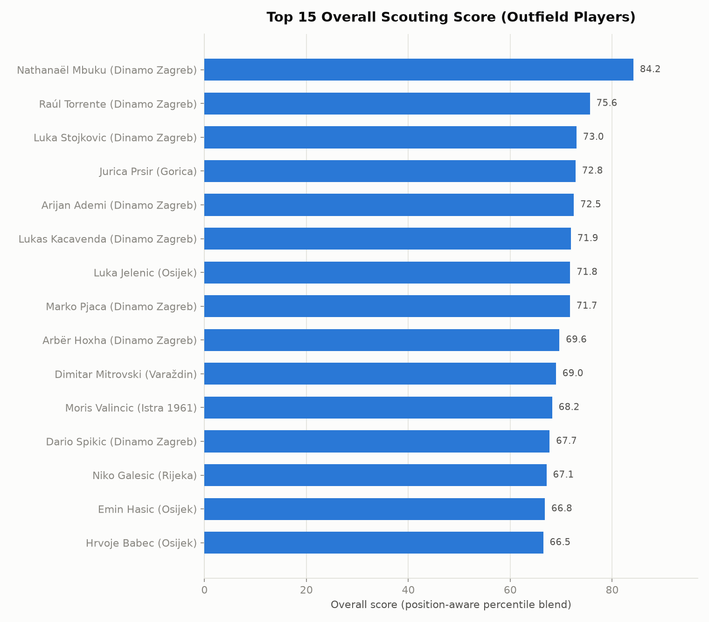

`overall_score` blends attacking, creative, and defensive contribution (each judged against same-position peers) plus a small discipline factor. Because each ingredient is now position-aware (Section 22 explains why), this list is no longer structurally tilted toward all-round midfielders - a specialist can top it by excelling relative to their own role's peers.

## 7. Best U23 Players

| Rank | Player | Team | Position | Age | Overall |
|:---|:---|:---|:---|:---|:---|
| 1 | Luka Stojkovic | Dinamo Zagreb | Midfielder | 22 | 73.0 |
| 2 | Lukas Kacavenda | Dinamo Zagreb | Midfielder | 23 | 71.9 |
| 3 | Moris Valincic | Istra 1961 | Defender | 23 | 68.2 |
| 4 | Emin Hasic | Osijek | Defender | 23 | 66.8 |
| 5 | Ivan Cvijanovic | Osijek | Defender | 22 | 65.4 |
| 6 | Vinko Rozic | Istra 1961 | Attacker | 22 | 64.7 |
| 7 | Niko Sigur | Hajduk Split | Midfielder | 22 | 64.0 |
| 8 | Ivan Laća | Šibenik | Attacker | 23 | 63.8 |
| 9 | Marko Soldo | Osijek | Midfielder | 22 | 62.8 |
| 10 | Adriano Jagusic | Slaven Koprivnica | Midfielder | 20 | 61.8 |

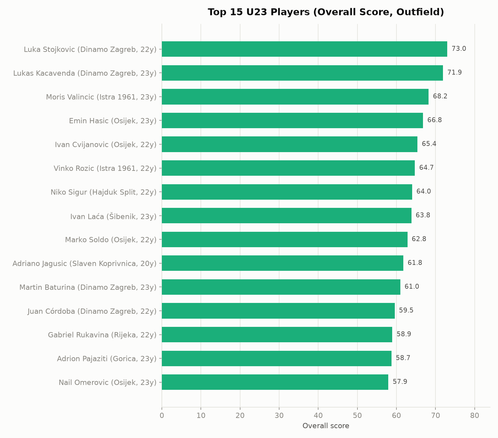

Same `overall_score` ranking, filtered to age 23 and under. Useful for spotting resale/development value rather than just current output - see Section 8 for a lens that also weighs age and playing-time reliability, not just current output.

### Best Goalkeepers (Separate Model)

Goalkeeping requires different inputs than outfield play, so `goalkeeper_score` is built from stats mapped specifically for this fix: saves per 90, clean sheet rate, goals conceded per 90 (inverted - fewer is better), penalties saved, and pass accuracy as a simple distribution-quality proxy. It's computed only among goalkeepers and never mixed with `overall_score`.


| Rank | Player | Team | Age | Goalkeeper Score |
|:---|:---|:---|:---|:---|
| 1 | Ivan Sušak | Slaven Koprivnica | 28 | 69.3 |
| 2 | Oliver Zelenika | Varaždin | 33 | 67.9 |
| 3 | Ivan Lucic | Hajduk Split | 31 | 66.4 |
| 4 | Ivan Banic | Gorica | 31 | 64.3 |
| 5 | Lovro Majkic | Istra 1961 | 26 | 61.4 |
| 6 | Martin Zlomislic | Rijeka | 27 | 56.4 |
| 7 | Danijel Zagorac | Dinamo Zagreb | 39 | 56.4 |
| 8 | Ivan Nevistic | Dinamo Zagreb | 27 | 53.6 |
| 9 | Marko Malenica | Osijek | 32 | 48.6 |
| 10 | Zvonimir Subaric | Lokomotiva Zagreb | 29 | 45.7 |

**Caveat:** this is a simple, explainable model over a small population (17-23 eligible goalkeepers) - it is not equivalent to a specialized goalkeeping model (e.g. post-shot expected goals / shot-stopping value above expected), which would need shot placement and quality data this API doesn't expose here.

## 8. Best Young Talents & Age-Aware Potential

`overall_score` answers "who's producing well right now" - it says nothing about whether a player is young enough to still be improving, or whether their output is backed by real, proven playing time. `age_potential_score` (Stage B1) adds that lens on top, as a simple, fully additive formula (every point is traceable to one of three ingredients, not an opaque blend):

```
age_potential_score = overall_score + age_bonus + reliability_bonus
```

- **`age_bonus`**: +2.0 points for every year younger than 23 (this project's U23 cutoff), capped at 6 years below it - so a 17-year-old and a 15-year-old both get the same capped maximum of +12, rather than an ever-larger reward the younger a player gets.
- **`reliability_bonus`**: a percentile rank of minutes played (0-100) among scoring-eligible players, scaled down to at most +8 points - rewards a young player who's already earning real first-team minutes, not just a promising cameo.

Like `overall_score`, this is an **outfield-only** lens - goalkeepers are excluded from every ranking below for the same reason they're excluded from Section 6.

### Best Young Talents (age <= 23)

| Rank | Player | Team | Position | Age | Overall | Age Bonus | Reliability | Potential |
|:---|:---|:---|:---|:---|:---|:---|:---|:---|
| 1 | Luka Stojkovic | Dinamo Zagreb | Midfielder | 22 | 73.0 | 2.0 | 4.2 | 79.2 |
| 2 | Moris Valincic | Istra 1961 | Defender | 23 | 68.2 | 0.0 | 6.9 | 75.2 |
| 3 | Lukas Kacavenda | Dinamo Zagreb | Midfielder | 23 | 71.9 | 0.0 | 1.0 | 72.8 |
| 4 | Adriano Jagusic | Slaven Koprivnica | Midfielder | 20 | 61.8 | 6.0 | 4.0 | 71.8 |
| 5 | Marko Soldo | Osijek | Midfielder | 22 | 62.8 | 2.0 | 6.3 | 71.1 |
| 6 | Niko Sigur | Hajduk Split | Midfielder | 22 | 64.0 | 2.0 | 4.5 | 70.5 |
| 7 | Emin Hasic | Osijek | Defender | 23 | 66.8 | 0.0 | 3.3 | 70.1 |
| 8 | Vinko Rozic | Istra 1961 | Attacker | 22 | 64.7 | 2.0 | 2.2 | 68.9 |
| 9 | Ivan Cvijanovic | Osijek | Defender | 22 | 65.4 | 2.0 | 1.4 | 68.8 |
| 10 | Ivan Laća | Šibenik | Attacker | 23 | 63.8 | 0.0 | 4.2 | 68.0 |

**`best_u23_players_by_potential`** (saved alongside `best_young_talents` in `data/output/top_players_hnl_2024_2025.csv`) is the exact same U23 pool and sort order as the table above - it's kept as a second category label specifically so it sits next to `best_u23` (Section 7) in the output, making the "current output" vs. "potential-adjusted" comparison for the same age bracket explicit.


### Best U21 Players (age <= 21, by potential)

| Rank | Player | Team | Position | Age | Overall | Potential |
|:---|:---|:---|:---|:---|:---|:---|
| 1 | Adriano Jagusic | Slaven Koprivnica | Midfielder | 20 | 61.8 | 71.8 |
| 2 | Agyemang Morrison | Šibenik | Defender | 21 | 55.0 | 66.4 |
| 3 | Bruno Durdov | Hajduk Split | Attacker | 18 | 51.6 | 63.4 |
| 4 | Lovre Kulusic | Šibenik | Midfielder | 19 | 52.6 | 62.1 |
| 5 | Matej Sakota | Slaven Koprivnica | Attacker | 21 | 54.4 | 58.9 |
| 6 | Luka Vrbancic | Lokomotiva Zagreb | Midfielder | 21 | 50.1 | 58.7 |
| 7 | Ante Kavelj | Šibenik | Midfielder | 20 | 46.4 | 56.2 |
| 8 | Rokas Pukstas | Hajduk Split | Midfielder | 21 | 44.1 | 51.8 |
| 9 | Luka Kapulica | Gorica | Midfielder | 21 | 44.6 | 50.2 |
| 10 | Feta Fetai | Lokomotiva Zagreb | Midfielder | 21 | 39.2 | 49.3 |

A stricter age bracket than U23 - useful for identifying development-squad-eligible talent specifically, not just "young by transfer-market standards".

## 9. Best Attackers

| Rank | Player | Team | Position | Age | Attacking |
|:---|:---|:---|:---|:---|:---|
| 1 | Ante Suto | Slaven Koprivnica | Attacker | 26 | 97.6 |
| 2 | Vinko Rozic | Istra 1961 | Attacker | 22 | 97.0 |
| 3 | Sandro Kulenovic | Dinamo Zagreb | Attacker | 26 | 97.0 |
| 4 | Marko Livaja | Hajduk Split | Attacker | 32 | 92.7 |
| 5 | Hernâni | Osijek | Attacker | 34 | 87.9 |
| 6 | Matej Sakota | Slaven Koprivnica | Attacker | 21 | 83.3 |
| 7 | Nathanaël Mbuku | Dinamo Zagreb | Attacker | 24 | 82.4 |
| 8 | Mirko Susak | Lokomotiva Zagreb | Attacker | 22 | 80.6 |
| 9 | Duje Cop | Rijeka | Attacker | 36 | 80.6 |
| 10 | Ilija Nestorovski | Slaven Koprivnica | Attacker | 36 | 79.4 |

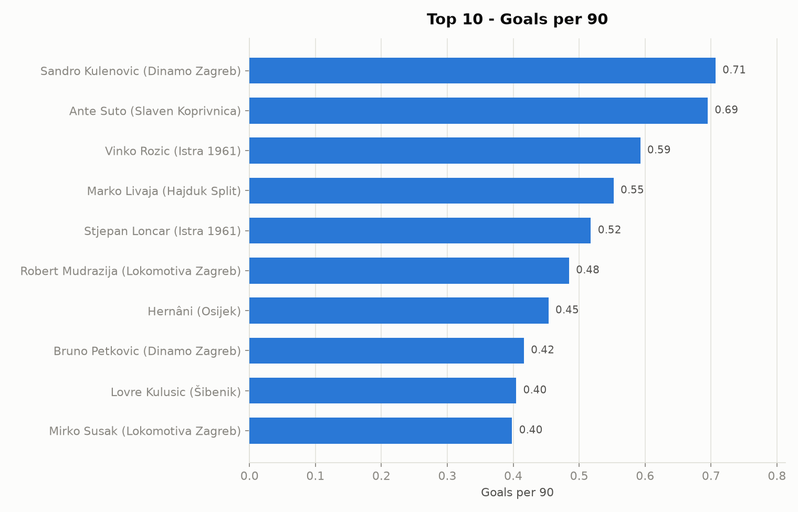

`attacking_score` is goal output, shots on target, and finishing quality, judged against other attackers - not raw goal totals, so a striker who has played fewer minutes but finishes efficiently isn't buried under a regular starter with more minutes.

## 10. Best Creators

| Rank | Player | Team | Position | Age | Creative |
|:---|:---|:---|:---|:---|:---|
| 1 | Juan Córdoba | Dinamo Zagreb | Attacker | 22 | 98.8 |
| 2 | Marko Pjaca | Dinamo Zagreb | Attacker | 31 | 93.3 |
| 3 | Marko Rog | Dinamo Zagreb | Midfielder | 30 | 91.8 |
| 4 | Stefan Ristovski | Dinamo Zagreb | Defender | 34 | 90.7 |
| 5 | Arbër Hoxha | Dinamo Zagreb | Attacker | 27 | 89.1 |
| 6 | Nathanaël Mbuku | Dinamo Zagreb | Attacker | 24 | 87.3 |
| 7 | Martin Baturina | Dinamo Zagreb | Midfielder | 23 | 86.3 |
| 8 | Petar Pusic | Osijek | Midfielder | 27 | 85.8 |
| 9 | Mateo Les | Gorica | Defender | 26 | 83.8 |
| 10 | Raúl Torrente | Dinamo Zagreb | Defender | 24 | 83.3 |

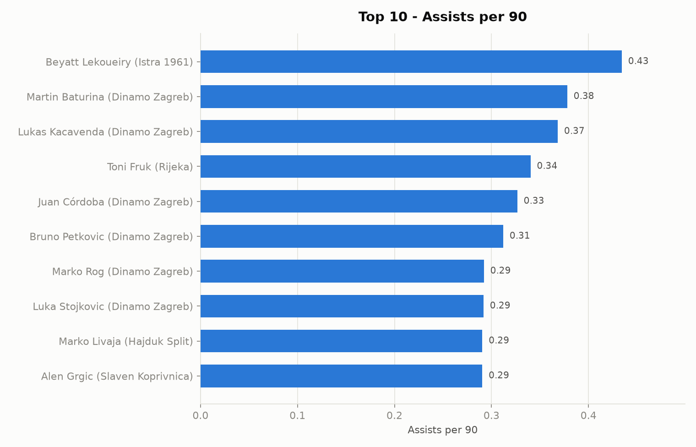

Unlike `best_midfield_creators` (position-filtered), `best_creators` is open to every position - it's a league-wide leaderboard of `creative_score` (assists, passing volume, passing quality), so a creative attacker or full-back can appear here too.

## 11. Best Defenders

| Rank | Player | Team | Position | Age | Defensive |
|:---|:---|:---|:---|:---|:---|
| 1 | Novak Tepsic | Varaždin | Defender | 24 | 87.7 |
| 2 | Iurie Iovu | Istra 1961 | Defender | 24 | 86.1 |
| 3 | Stephane Keller | Istra 1961 | Defender | 24 | 81.9 |
| 4 | Ivan Nekic | Varaždin | Defender | 25 | 78.7 |
| 5 | Dario Melnjak | Hajduk Split | Defender | 33 | 77.8 |
| 6 | Ivan Smolcic | Rijeka | Defender | 25 | 77.8 |
| 7 | Moris Valincic | Istra 1961 | Defender | 23 | 75.9 |
| 8 | Luka Jelenic | Osijek | Defender | 26 | 75.5 |
| 9 | Leonardo Sigali | Lokomotiva Zagreb | Defender | 39 | 75.0 |
| 10 | Filip Uremovic | Hajduk Split | Defender | 29 | 72.7 |

`defensive_score` (tackles, interceptions, duel success) is judged against other defenders, so it measures 'best defender relative to defenders', not 'most tackles in the league' - see `best_duel_defenders` (Section 14) for the raw, pool-wide version of ball-winning ability.

## 12. Best Dribblers

| Rank | Player | Team | Position | Dribbles/90 | Success % |
|:---|:---|:---|:---|:---|:---|
| 1 | Martin Baturina | Dinamo Zagreb | Midfielder | 1.82 | 50.5 |
| 2 | Adrion Pajaziti | Gorica | Midfielder | 1.09 | 54.3 |
| 3 | Lukas Kacavenda | Dinamo Zagreb | Midfielder | 1.35 | 50.0 |
| 4 | Ante Suto | Slaven Koprivnica | Attacker | 1.56 | 50.0 |
| 5 | Bruno Petkovic | Dinamo Zagreb | Attacker | 1.04 | 50.0 |
| 6 | Toni Fruk | Rijeka | Midfielder | 1.33 | 47.0 |
| 7 | Iker Pozo | Šibenik | Midfielder | 1.04 | 55.6 |
| 8 | Giorgi Gagua | Istra 1961 | Attacker | 0.83 | 51.9 |
| 9 | Dimitar Mitrovski | Varaždin | Attacker | 1.58 | 45.1 |
| 10 | Moris Valincic | Istra 1961 | Defender | 1.03 | 54.5 |

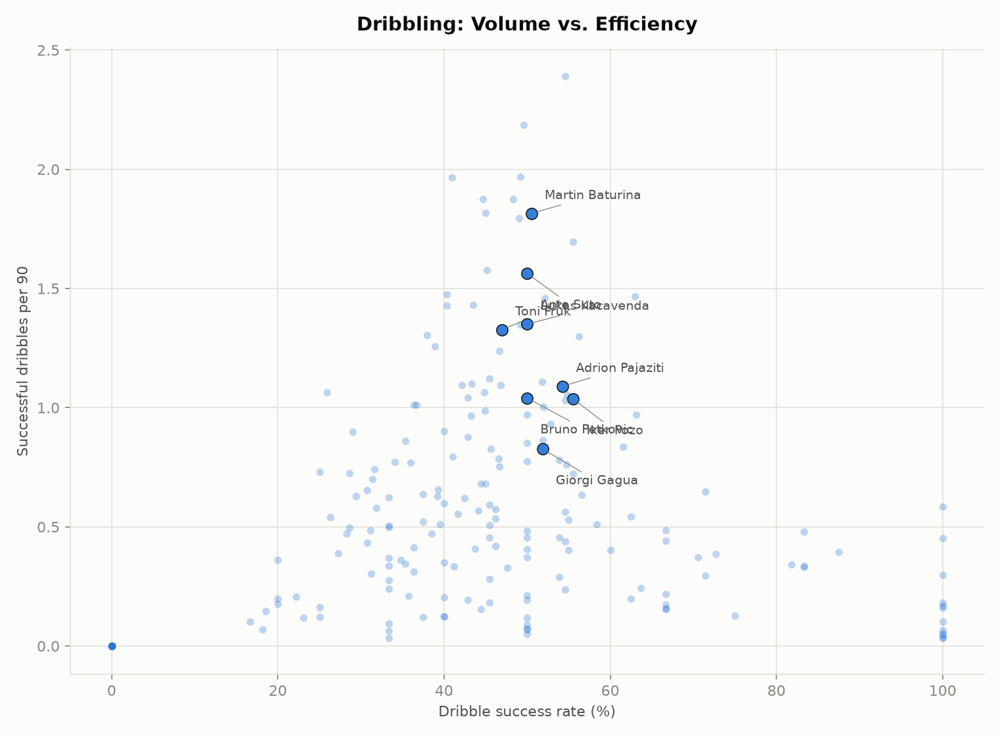

`dribbling_score` combines volume (successful dribbles per 90) with quality (% of attempts that succeed), so a player who tries 10 to land 2 doesn't outrank one who tries 3 to land 2. The scatter above makes that trade-off visible: top-right is the rare combination of trying often *and* succeeding often.

## 13. Best Passers

| Rank | Player | Team | Position | Passes/90 | Key Passes/90 | Accuracy % |
|:---|:---|:---|:---|:---|:---|:---|
| 1 | Ivan Rakitić | Hajduk Split | Midfielder | 57.9 | 2.20 | 81.4 |
| 2 | Tiago Dantas | Osijek | Midfielder | 51.0 | 1.58 | 87.4 |
| 3 | Petar Pusic | Osijek | Midfielder | 48.3 | 1.86 | 85.9 |
| 4 | Ljuban Crepulja | Slaven Koprivnica | Midfielder | 51.6 | 1.25 | 85.2 |
| 5 | Marko Rog | Dinamo Zagreb | Midfielder | 49.7 | 1.90 | 87.3 |
| 6 | Jurica Prsir | Gorica | Midfielder | 51.9 | 1.37 | 82.9 |
| 7 | Luka Stojkovic | Dinamo Zagreb | Midfielder | 45.9 | 3.09 | 80.6 |
| 8 | Stefan Ristovski | Dinamo Zagreb | Defender | 60.6 | 0.90 | 86.9 |
| 9 | Simun Mikolcic | Osijek | Midfielder | 49.1 | 1.30 | 80.2 |
| 10 | Martin Baturina | Dinamo Zagreb | Midfielder | 47.8 | 3.40 | 84.8 |

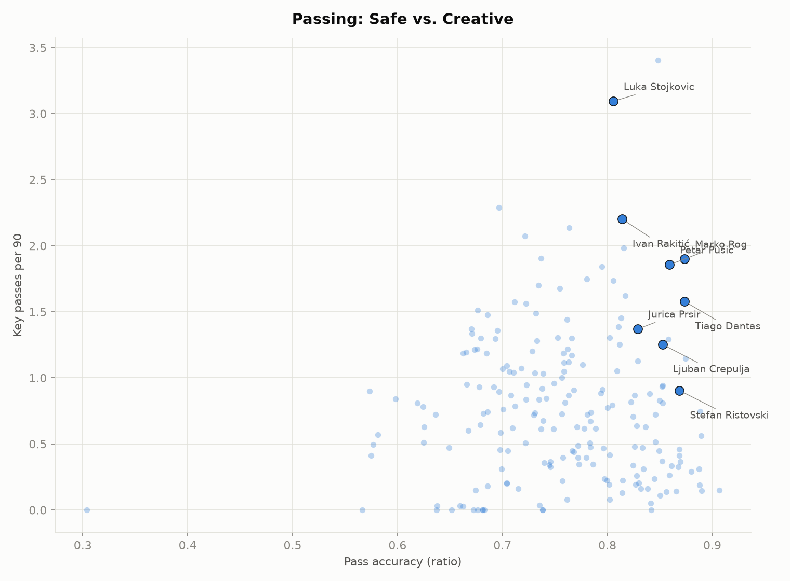

`passing_score` deliberately treats pass accuracy as only one of five equally-weighted ingredients - a centre-back playing safe five-yard passes all game can hit 95% accuracy without creating anything. The scatter separates 'safe' passers (bottom-right: high accuracy, few key passes) from genuinely creative ones (top area: passes that actually lead to a shot).

## 14. Best Duel Defenders

| Rank | Player | Team | Position | Tackles/90 | Interceptions/90 | Aerials Won/90 |
|:---|:---|:---|:---|:---|:---|:---|
| 1 | Iurie Iovu | Istra 1961 | Defender | 2.67 | 1.29 | 3.54 |
| 2 | Ivan Nekic | Varaždin | Defender | 1.86 | 1.80 | 2.54 |
| 3 | Luka Jelenic | Osijek | Defender | 1.95 | 1.71 | 2.59 |
| 4 | Slavko Bralic | Gorica | Defender | 1.56 | 1.85 | 3.60 |
| 5 | Novak Tepsic | Varaždin | Defender | 2.66 | 1.45 | 1.61 |
| 6 | Filip Uremovic | Hajduk Split | Defender | 1.68 | 1.46 | 3.30 |
| 7 | Denis Kolinger | Lokomotiva Zagreb | Defender | 1.43 | 1.83 | 3.50 |
| 8 | Luka Skaricic | Varaždin | Defender | 1.75 | 1.11 | 3.02 |
| 9 | Ivan Smolcic | Rijeka | Defender | 2.13 | 2.07 | 2.30 |
| 10 | Emin Hasic | Osijek | Defender | 2.59 | 1.36 | 2.52 |

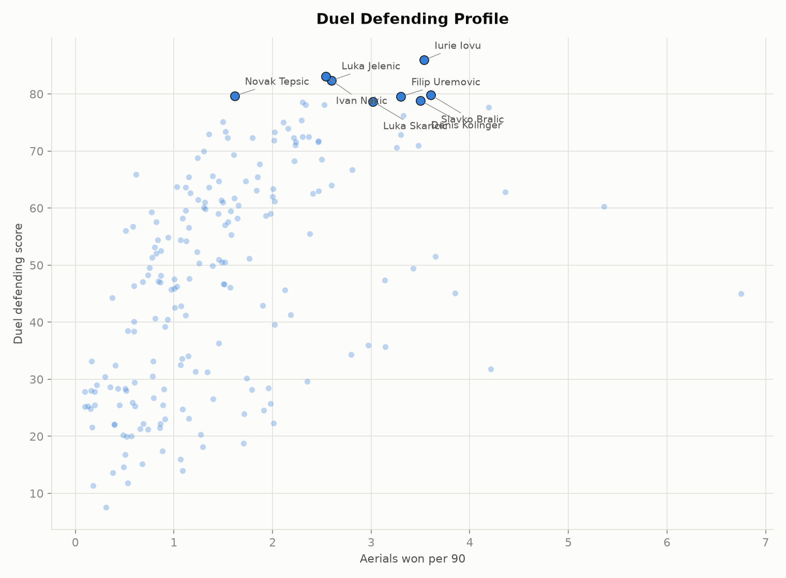

`duel_defending_score` is pure ball-winning ability (tackles, interceptions, aerials, duel success), judged league-wide rather than only against other defenders - so a defensively strong midfielder can also show up here, which `best_defenders` (position-filtered) would miss.

## 15. Best Progressive Midfielders

| Rank | Player | Team | Age | Progressive MF | Key Passes/90 |
|:---|:---|:---|:---|:---|:---|
| 1 | Luka Stojkovic | Dinamo Zagreb | 22 | 86.9 | 3.09 |
| 2 | Martin Baturina | Dinamo Zagreb | 23 | 82.4 | 3.40 |
| 3 | Toni Fruk | Rijeka | 25 | 78.3 | 1.91 |
| 4 | Petar Pusic | Osijek | 27 | 77.9 | 1.86 |
| 5 | Adriano Jagusic | Slaven Koprivnica | 20 | 77.5 | 1.12 |
| 6 | Marko Rog | Dinamo Zagreb | 30 | 76.2 | 1.90 |
| 7 | Stjepan Loncar | Istra 1961 | 29 | 74.2 | 1.98 |
| 8 | Beyatt Lekoueiry | Istra 1961 | 21 | 71.3 | 1.56 |
| 9 | Jurica Prsir | Gorica | 26 | 71.3 | 1.37 |
| 10 | Lukas Kacavenda | Dinamo Zagreb | 23 | 70.1 | 1.84 |

**Important caveat:** SportMonks doesn't expose true 'progressive passes' or 'progressive carries into the final third' on this plan, so `progressive_midfielder_score` is a **proxy** built from what is available - key passes, long balls, successful dribbles, and assists. It's a reasonable stand-in, not the real metric elite scouting platforms use, and should be read as 'forward-thinking involvement', not literal progressive-pass counts.

## 16. Best Passer Defenders / Ball-Playing Defenders

| Rank | Player | Team | Age | Passer Defender | Passes/90 | Accuracy % |
|:---|:---|:---|:---|:---|:---|:---|
| 1 | Stephane Keller | Istra 1961 | 24 | 72.6 | 49.8 | 82.8 |
| 2 | Ivan Nekic | Varaždin | 25 | 72.2 | 54.2 | 81.5 |
| 3 | Leonardo Sigali | Lokomotiva Zagreb | 39 | 70.8 | 47.5 | 85.9 |
| 4 | Moris Valincic | Istra 1961 | 23 | 69.0 | 46.6 | 84.6 |
| 5 | Dario Maresic | Istra 1961 | 26 | 67.7 | 58.3 | 77.8 |
| 6 | Ivan Smolcic | Rijeka | 25 | 67.7 | 41.2 | 70.4 |
| 7 | Raúl Torrente | Dinamo Zagreb | 24 | 67.2 | 62.7 | 86.8 |
| 8 | Filip Uremovic | Hajduk Split | 29 | 65.5 | 50.2 | 83.8 |
| 9 | Maxime Bernauer | Dinamo Zagreb | 28 | 64.9 | 68.6 | 87.0 |
| 10 | Alessandro Tuia | Osijek | 36 | 64.6 | 48.0 | 79.7 |

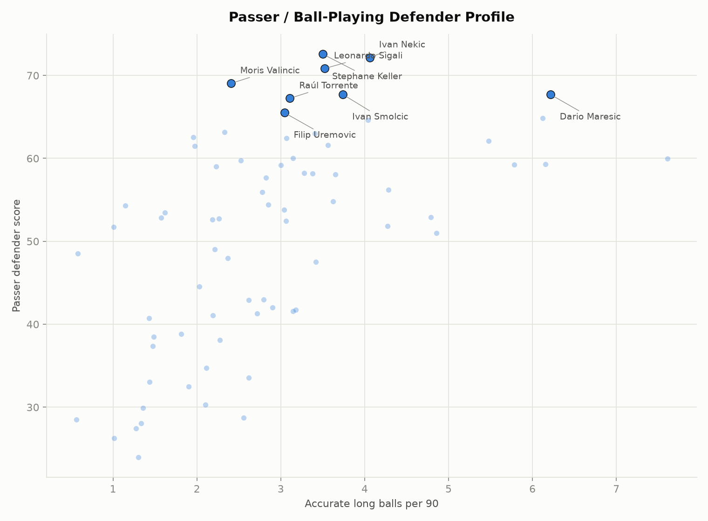

`best_passer_defenders` and `best_ball_playing_defenders` are **the same ranking** - both are sorted by one shared `passer_defender_score` (50% within-position passing quality, 50% `defensive_score`) rather than two separate formulas, by design decision during Stage 1/2.

**Position caveat:** SportMonks only exposes coarse positions here - `Defender`, `Midfielder`, `Attacker`, `Goalkeeper` - with no centre-back/full-back/wing-back split. So this ranking can say 'this defender passes and defends well' but cannot separate a ball-playing centre-back from an overlapping full-back the way a platform with detailed positions could.

### Comparing the specialists

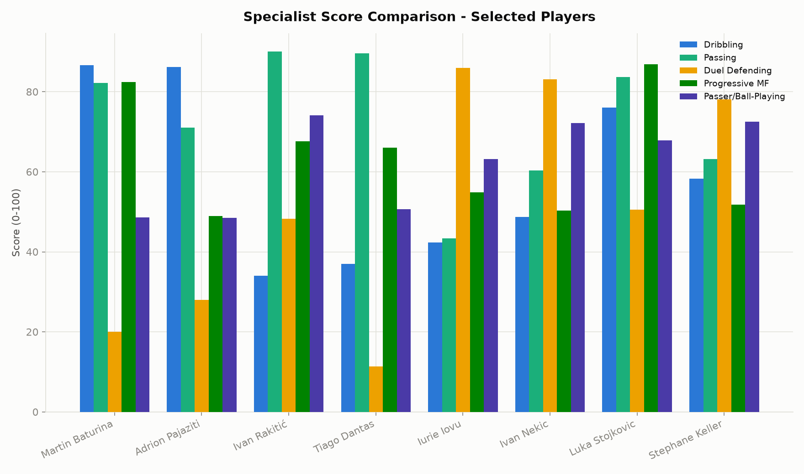

A snapshot of the five specialist scores (Sections 12-16) side by side for a handful of players pulled from the top of each category. Notice how uneven each player's bars are - that's the point of having five separate scores instead of one: a player can be a 90+ dribbler and a below-average passer at the same time, and a single blended score would hide that.

## 17. Underrated Players, Hidden Gems & Small-Club Standouts

Stage B2 adds team context on top of `overall_score`: `team_average_score` (a team's own mean `overall_score` among its eligible outfield players, goalkeepers excluded) and `score_above_team_average` (`overall_score - team_average_score` - a literal gap, positive means outperforming your own teammates). `underrated_score` then blends two capped bonuses onto `overall_score`:

```
underrated_score = overall_score + standout_bonus + weak_team_bonus
```

- **`standout_bonus`**: only the *positive* part of `score_above_team_average` counts (underperforming your own team isn't 'underrated'), capped before a 0.5 weight.
- **`weak_team_bonus`**: `league_average_team_score - team_average_score`, clipped to >= 0 and capped before a 0.5 weight - `league_average_team_score` is the mean of every team's own average (one vote per team, not per player, so one big squad can't skew the baseline). This is the computed, reproducible replacement for this project's earlier fixed 'exclude the three big clubs' list.


### Underrated Players

| Player | Team | Position | Age | Overall | Standout | Weak-Team | Underrated |
|:---|:---|:---|:---|:---|:---|:---|:---|
| Nathanaël Mbuku | Dinamo Zagreb | Attacker | 24 | 84.2 | 10.4 | 0.0 | 94.6 |
| Jurica Prsir | Gorica | Midfielder | 26 | 72.8 | 14.1 | 2.8 | 89.7 |
| Raúl Torrente | Dinamo Zagreb | Defender | 24 | 75.6 | 6.1 | 0.0 | 81.7 |
| Luka Jelenic | Osijek | Defender | 26 | 71.8 | 9.8 | 0.0 | 81.5 |
| Dimitar Mitrovski | Varaždin | Attacker | 27 | 69.0 | 10.3 | 1.0 | 80.3 |
| Moris Valincic | Istra 1961 | Defender | 23 | 68.2 | 9.4 | 0.5 | 78.2 |
| Luka Stojkovic | Dinamo Zagreb | Midfielder | 22 | 73.0 | 4.8 | 0.0 | 77.8 |
| Arijan Ademi | Dinamo Zagreb | Midfielder | 35 | 72.5 | 4.5 | 0.0 | 77.0 |

**Important: this table can still include big-club players.** `underrated_players` only requires outperforming your *own* teammates, regardless of how strong the squad around you is - so a Dinamo Zagreb or Hajduk Split player who clearly outshines their (already strong) teammates can legitimately appear here (note several do, below). It is **not** a small-club-only list - for that, see the two stricter views below.


### Hidden Gems

Requires *both* signals at once: outperforms their own team (`standout_bonus > 0`) **and** plays for a squad below the league's average team (`weak_team_bonus > 0`). This is the stricter, small-club-focused view.


| Rank | Player | Team | Position | Age | Overall | Standout | Weak-Team | Underrated |
|:---|:---|:---|:---|:---|:---|:---|:---|:---|
| 1 | Jurica Prsir | Gorica | Midfielder | 26 | 72.8 | 14.1 | 2.8 | 89.7 |
| 2 | Dimitar Mitrovski | Varaždin | Attacker | 27 | 69.0 | 10.3 | 1.0 | 80.3 |
| 3 | Moris Valincic | Istra 1961 | Defender | 23 | 68.2 | 9.4 | 0.5 | 78.2 |
| 4 | Ivan Laća | Šibenik | Attacker | 23 | 63.8 | 9.2 | 2.5 | 75.5 |
| 5 | Filip Uremovic | Hajduk Split | Defender | 29 | 66.1 | 8.2 | 0.4 | 74.7 |
| 6 | Vinko Rozic | Istra 1961 | Attacker | 22 | 64.7 | 7.7 | 0.5 | 72.9 |
| 7 | Šime Gržan | Šibenik | Attacker | 32 | 61.5 | 8.1 | 2.5 | 72.0 |
| 8 | Niko Sigur | Hajduk Split | Midfielder | 22 | 64.0 | 7.2 | 0.4 | 71.6 |

### Small-Club Standouts

Requires only the team-context signal (`weak_team_bonus > 0`), sorted by plain `overall_score` rather than the blended score - "who's the best individual performer at a smaller club", regardless of the gap to their own teammates.


| Rank | Player | Team | Position | Age | Overall | Weak-Team Bonus |
|:---|:---|:---|:---|:---|:---|:---|
| 1 | Jurica Prsir | Gorica | Midfielder | 26 | 72.8 | 2.8 |
| 2 | Dimitar Mitrovski | Varaždin | Attacker | 27 | 69.0 | 1.0 |
| 3 | Moris Valincic | Istra 1961 | Defender | 23 | 68.2 | 0.5 |
| 4 | Filip Uremovic | Hajduk Split | Defender | 29 | 66.1 | 0.4 |
| 5 | Vinko Rozic | Istra 1961 | Attacker | 22 | 64.7 | 0.5 |
| 6 | Niko Sigur | Hajduk Split | Midfielder | 22 | 64.0 | 0.4 |
| 7 | Ivan Laća | Šibenik | Attacker | 23 | 63.8 | 2.5 |
| 8 | Filip Krovinovic | Hajduk Split | Midfielder | 30 | 63.4 | 0.4 |

None of these three views are a market-value or 'true team strength' model - they're reproducible statistical proxies for visibility, not scouting verdicts (see Section 24).

## 18. Player Similarity Examples

Stage B3 added optional filters to the similarity search - applied to *candidates* only, after cosine similarity is computed against the full eligible pool: `same_position_only` (exact position match), `same_team_exclude` (drop the query player's own club), `min_minutes` (a stricter reliability floor), and `max_age` (e.g. for 'similar young players'). The examples below show a mix of filtered and unfiltered searches.


**Luka Stojkovic - role: `midfielder`** - filters: `same_position_only=True`

| Rank | Player | Team | Position | Similarity |
|:---|:---|:---|:---|:---|
| 1 | Martin Baturina | Dinamo Zagreb | Midfielder | 0.96 |
| 2 | Amer Gojak | Rijeka | Midfielder | 0.89 |
| 3 | Marko Rog | Dinamo Zagreb | Midfielder | 0.89 |
| 4 | Lukas Kacavenda | Dinamo Zagreb | Midfielder | 0.88 |
| 5 | Petar Pusic | Osijek | Midfielder | 0.79 |
| 6 | Ivan Ćalušić | Istra 1961 | Midfielder | 0.78 |
| 7 | Toni Fruk | Rijeka | Midfielder | 0.77 |
| 8 | Luka Mamic | Varaždin | Midfielder | 0.75 |
| 9 | Mihail Caimacov | Slaven Koprivnica | Midfielder | 0.72 |
| 10 | Adriano Jagusic | Slaven Koprivnica | Midfielder | 0.71 |

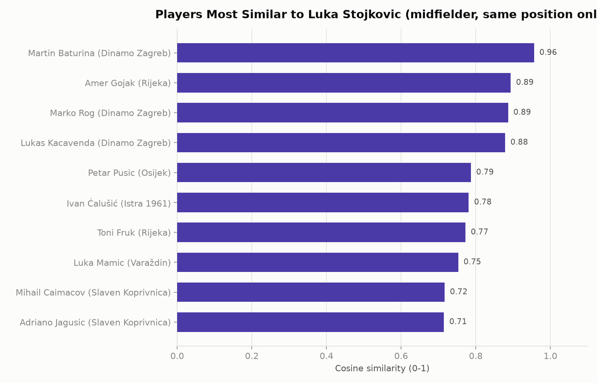

*The chart shows cosine similarity (0-1) for each match - see section 19 for what that number means.*

**Stephane Keller - role: `passer_defender`**

| Rank | Player | Team | Position | Similarity |
|:---|:---|:---|:---|:---|
| 1 | Leonardo Sigali | Lokomotiva Zagreb | Defender | 0.93 |
| 2 | Luka Skaricic | Varaždin | Defender | 0.93 |
| 3 | Tomislav Duvnjak | Varaždin | Midfielder | 0.92 |
| 4 | Filip Uremovic | Hajduk Split | Defender | 0.91 |
| 5 | Ivan Nekic | Varaždin | Defender | 0.90 |
| 6 | Novak Tepsic | Varaždin | Defender | 0.89 |
| 7 | Emin Hasic | Osijek | Defender | 0.87 |
| 8 | Tomislav Bozic | Slaven Koprivnica | Defender | 0.86 |
| 9 | Hrvoje Babec | Osijek | Midfielder | 0.85 |
| 10 | Luka Jelenic | Osijek | Defender | 0.83 |

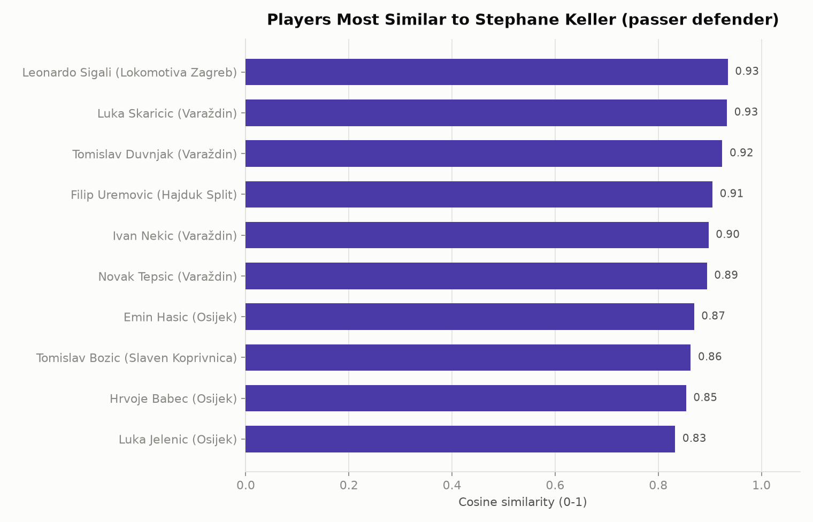

*The chart shows cosine similarity (0-1) for each match - see section 19 for what that number means.*

**Ante Suto - role: `attacker`**

| Rank | Player | Team | Position | Similarity |
|:---|:---|:---|:---|:---|
| 1 | Marko Livaja | Hajduk Split | Attacker | 0.99 |
| 2 | Martin Slogar | Gorica | Attacker | 0.99 |
| 3 | Arnel Jakupovic | Osijek | Attacker | 0.99 |
| 4 | Arijan Ademi | Dinamo Zagreb | Midfielder | 0.98 |
| 5 | Vinko Rozic | Istra 1961 | Attacker | 0.98 |
| 6 | Sandro Kulenovic | Dinamo Zagreb | Attacker | 0.97 |
| 7 | Nathanaël Mbuku | Dinamo Zagreb | Attacker | 0.97 |
| 8 | Lovre Kulusic | Šibenik | Midfielder | 0.97 |
| 9 | Robert Mudrazija | Lokomotiva Zagreb | Midfielder | 0.96 |
| 10 | Dimitar Mitrovski | Varaždin | Attacker | 0.96 |

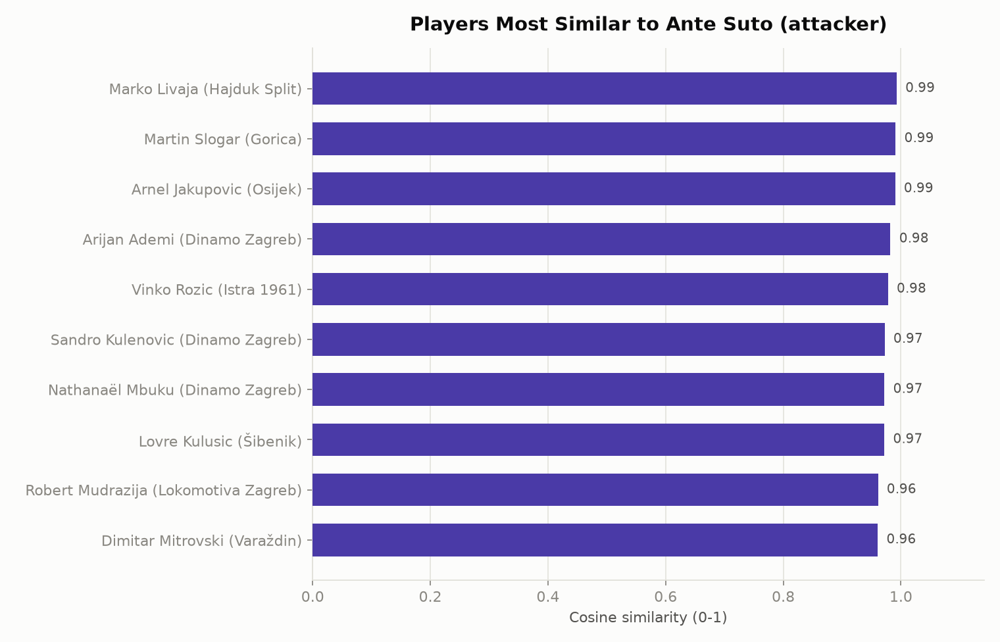

*The chart shows cosine similarity (0-1) for each match - see section 19 for what that number means.*

**Adriano Jagusic - role: `overall`** - filters: `max_age<=23`

| Rank | Player | Team | Position | Similarity |
|:---|:---|:---|:---|:---|
| 1 | Lukas Kacavenda | Dinamo Zagreb | Midfielder | 0.66 |
| 2 | Martin Baturina | Dinamo Zagreb | Midfielder | 0.60 |
| 3 | Luka Stojkovic | Dinamo Zagreb | Midfielder | 0.55 |
| 4 | Nail Omerovic | Osijek | Attacker | 0.51 |
| 5 | Luka Kapulica | Gorica | Midfielder | 0.50 |
| 6 | Juan Córdoba | Dinamo Zagreb | Attacker | 0.48 |
| 7 | Marko Soldo | Osijek | Midfielder | 0.46 |
| 8 | Luka Vrbancic | Lokomotiva Zagreb | Midfielder | 0.45 |
| 9 | Vinko Rozic | Istra 1961 | Attacker | 0.43 |
| 10 | Stipe Biuk | Hajduk Split | Attacker | 0.41 |

*The chart shows cosine similarity (0-1) for each match - see section 19 for what that number means.*

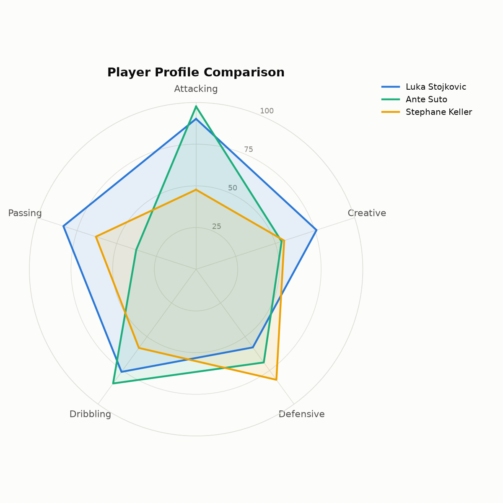

The radar chart puts 3 query players (the same midfielder/attacker/defender examples used above) on the same five axes (attacking/creative/defensive/dribbling/passing scores). It makes each player's *shape* obvious at a glance - a specialist spikes hard on one or two axes and barely registers elsewhere, while an all-rounder stays more balanced across several dimensions - which is exactly why role-based similarity search (Section 19) matters more than a single 'overall' comparison.

## 19. How Cosine Similarity Works (in Scouting Terms)

Picture each player as a list of numbers - their per-90 rates and ratios for a chosen role (e.g. for `attacker`: `[goals_per90, shots_per90, shot_accuracy, ...]`). That list is a *vector*, a point in space with one axis per stat.

**Cosine similarity measures the angle between two players' vectors, not the distance.** That distinction matters: a bench player with 500 minutes and a nailed-on starter with 2500 minutes can have nearly identical *rates* (goals per 90, pass accuracy...) even though their raw totals are worlds apart. Cosine similarity says 'these two play the same way'; a raw-numbers comparison would wrongly say 'these two have nothing in common' just because one has played far more matches. A score of 1.0 means an identical statistical shape; 0 means no relationship. Every stat is standardized first (rescaled to the same spread) so a big-number stat like `passes_per90` doesn't automatically drown out a small-number stat like `goals_per90`.

**Why role-based, not one universal comparison:** comparing a striker to a centre-back on `shots_per90` is meaningless - the centre-back will always look like an outlier on stats that aren't part of their job. Each role (`attacker`, `passer`, `duel_defender`, `goalkeeper`, ...) restricts the comparison to only the stats relevant to that role, so 'similar' means 'plays a similar game', not 'happens to share a few numbers by coincidence'.

## 20. Replacement Scouting

**This is a statistical shortlist, not a final transfer recommendation.** `src/replacement_scouting.py` builds on the similarity search above: given a departing player, it re-ranks the filtered candidate pool by `replacement_score`, a weighted sum of four signals plus one small tie-breaker:

```
replacement_score = 0.4 * (similarity * 100)
                   + 0.3 * age_potential_score
                   + 0.2 * underrated_score
                   + 0.1 * reliability_percentile
                   + younger_bonus (+5 if candidate is younger than the departing player)
```

- **similarity** (highest weight) - is the candidate actually the same *kind* of player? A statistically dissimilar candidate isn't a real replacement no matter how good their other numbers are.
- **`age_potential_score`** (Section 8) - good now, with runway to keep improving.
- **`underrated_score`** (Section 17) - a nod toward value, not just quality.
- **`reliability_percentile`** - minutes rank *within this specific candidate pool* (not the whole league) - the smallest weight, used only as a tie-breaker.

By default, `same_position_only=True` and `same_team_exclude=True` (a replacement is normally sought at the same position, outside the player's own squad), and the role defaults to whatever matches the departing player's own position.

**It says nothing about video-scouted technique, tactical fit, injury history, character, or transfer feasibility** (fee, release clause, wages, contract length) - treat it as a reproducible first-pass shortlist for a human scout to start from, not a conclusion.

**Replacement targets for Ante Suto** (role: `attacker`)

| Rank | Player | Team | Position | Age | Similarity | Potential | Underrated | Younger Bonus | Replacement Score |
|:---|:---|:---|:---|:---|:---|:---|:---|:---|:---|
| 1 | Nathanaël Mbuku | Dinamo Zagreb | Attacker | 24 | 0.97 | 84.4 | 94.6 | 5.0 | 88.5 |
| 2 | Dimitar Mitrovski | Varaždin | Attacker | 27 | 0.96 | 74.7 | 80.3 | 0.0 | 85.2 |
| 3 | Marko Pjaca | Dinamo Zagreb | Attacker | 31 | 0.91 | 78.1 | 75.9 | 0.0 | 84.1 |
| 4 | Vinko Rozic | Istra 1961 | Attacker | 22 | 0.98 | 68.9 | 72.9 | 5.0 | 83.3 |
| 5 | Marko Livaja | Hajduk Split | Attacker | 32 | 0.99 | 64.6 | 60.4 | 0.0 | 81.2 |
| 6 | Nail Omerovic | Osijek | Attacker | 23 | 0.86 | 64.0 | 60.8 | 5.0 | 79.6 |
| 7 | Marco Pašalić | Rijeka | Attacker | 25 | 0.84 | 68.9 | 72.4 | 5.0 | 79.4 |
| 8 | Sandro Kulenovic | Dinamo Zagreb | Attacker | 26 | 0.97 | 66.0 | 60.7 | 0.0 | 78.7 |
| 9 | Ivan Laća | Šibenik | Attacker | 23 | 0.73 | 68.0 | 75.5 | 5.0 | 76.7 |
| 10 | Michele Sego | Varaždin | Attacker | 25 | 0.77 | 65.5 | 69.3 | 5.0 | 75.4 |

**Replacement targets for Luka Stojkovic** (role: `midfielder`)

| Rank | Player | Team | Position | Age | Similarity | Potential | Underrated | Younger Bonus | Replacement Score |
|:---|:---|:---|:---|:---|:---|:---|:---|:---|:---|
| 1 | Adriano Jagusic | Slaven Koprivnica | Midfielder | 20 | 0.71 | 71.8 | 67.0 | 5.0 | 73.6 |
| 2 | Ivan Rakitić | Hajduk Split | Midfielder | 38 | 0.63 | 68.6 | 66.5 | 0.0 | 69.1 |
| 3 | Marko Soldo | Osijek | Midfielder | 22 | 0.63 | 71.1 | 68.1 | 0.0 | 68.6 |
| 4 | Jurica Prsir | Gorica | Midfielder | 26 | 0.55 | 76.7 | 89.7 | 0.0 | 67.6 |
| 5 | Toni Fruk | Rijeka | Midfielder | 25 | 0.77 | 55.9 | 48.9 | 0.0 | 66.5 |
| 6 | Luka Mamic | Varaždin | Midfielder | 23 | 0.75 | 55.7 | 52.1 | 0.0 | 64.7 |
| 7 | Petar Pusic | Osijek | Midfielder | 27 | 0.79 | 59.0 | 57.0 | 0.0 | 64.4 |
| 8 | Stjepan Loncar | Istra 1961 | Midfielder | 29 | 0.71 | 60.8 | 63.9 | 0.0 | 61.3 |
| 9 | Antonio Mauric | Istra 1961 | Midfielder | 22 | 0.54 | 63.1 | 59.7 | 0.0 | 59.4 |
| 10 | Amer Gojak | Rijeka | Midfielder | 29 | 0.89 | 40.8 | 38.4 | 0.0 | 57.8 |

**Replacement targets for Stephane Keller** (role: `defender`)

| Rank | Player | Team | Position | Age | Similarity | Potential | Underrated | Younger Bonus | Replacement Score |
|:---|:---|:---|:---|:---|:---|:---|:---|:---|:---|
| 1 | Emin Hasic | Osijek | Defender | 23 | 0.71 | 70.1 | 74.1 | 5.0 | 73.4 |
| 2 | Filip Uremovic | Hajduk Split | Defender | 29 | 0.58 | 73.4 | 74.7 | 0.0 | 69.1 |
| 3 | Stefan Ristovski | Dinamo Zagreb | Defender | 34 | 0.78 | 63.1 | 57.9 | 0.0 | 67.9 |
| 4 | Ronaël Pierre-Gabriel | Dinamo Zagreb | Defender | 28 | 0.68 | 69.2 | 63.0 | 0.0 | 67.6 |
| 5 | Ismaël Diallo | Hajduk Split | Defender | 29 | 0.80 | 55.2 | 51.0 | 0.0 | 64.9 |
| 6 | Luka Jelenic | Osijek | Defender | 26 | 0.36 | 78.5 | 81.5 | 0.0 | 62.5 |
| 7 | Stefan Peric | Šibenik | Defender | 29 | 0.59 | 57.4 | 57.7 | 0.0 | 59.1 |
| 8 | Denis Kolinger | Lokomotiva Zagreb | Defender | 32 | 0.54 | 60.2 | 59.1 | 0.0 | 58.5 |
| 9 | Lamine Ba | Varaždin | Defender | 28 | 0.48 | 62.0 | 59.6 | 0.0 | 58.1 |
| 10 | Tomislav Bozic | Slaven Koprivnica | Defender | 38 | 0.32 | 69.5 | 67.4 | 0.0 | 56.8 |

**Replacement targets for Luka Stojkovic** (role: `midfielder`)

| Rank | Player | Team | Position | Age | Similarity | Potential | Underrated | Younger Bonus | Replacement Score |
|:---|:---|:---|:---|:---|:---|:---|:---|:---|:---|
| 1 | Adriano Jagusic | Slaven Koprivnica | Midfielder | 20 | 0.71 | 71.8 | 67.0 | 5.0 | 73.3 |
| 2 | Marko Soldo | Osijek | Midfielder | 22 | 0.63 | 71.1 | 68.1 | 0.0 | 69.3 |
| 3 | Luka Mamic | Varaždin | Midfielder | 23 | 0.75 | 55.7 | 52.1 | 0.0 | 65.3 |
| 4 | Antonio Mauric | Istra 1961 | Midfielder | 22 | 0.54 | 63.1 | 59.7 | 0.0 | 60.1 |
| 5 | Beyatt Lekoueiry | Istra 1961 | Midfielder | 21 | 0.66 | 48.3 | 42.7 | 5.0 | 57.8 |
| 6 | Art Smakaj | Lokomotiva Zagreb | Midfielder | 23 | 0.42 | 55.3 | 50.1 | 0.0 | 53.5 |
| 7 | Luka Vrbancic | Lokomotiva Zagreb | Midfielder | 21 | 0.29 | 58.7 | 52.9 | 5.0 | 51.4 |
| 8 | Rokas Pukstas | Hajduk Split | Midfielder | 21 | 0.32 | 51.8 | 44.5 | 5.0 | 46.0 |
| 9 | Simun Mikolcic | Osijek | Midfielder | 22 | 0.32 | 58.8 | 58.0 | 0.0 | 42.4 |
| 10 | Niko Sigur | Hajduk Split | Midfielder | 22 | 0.01 | 70.5 | 71.6 | 0.0 | 42.0 |

## 21. Player Cluster Profiles

**Clustering groups players by statistical profile, not by absolute quality.** KMeans has no notion of 'good' or 'bad' - it only finds players whose per-90 rates sit close together in feature space, the same underlying idea as the cosine-similarity search (Section 19) but grouping many players instead of comparing two. An elite player and a modest one can land in the same cluster if their rates have a similar *shape* - a cluster describes a **playing style**, not a tier.

Goalkeepers are clustered separately from outfield players (their near-zero outfield stats would otherwise just form one arbitrary 'goalkeeper' cluster): 8 clusters for outfield players, 2 for goalkeepers. Each cluster is named by comparing its own average stats against the population average (a z-score per feature), then matching that profile against a set of predefined archetype signatures - if no archetype clears a confidence bar, the cluster keeps a neutral `balanced profile` label instead of a forced one. **Cluster names describe playing style, not literal position** - clustering never looks at the `position` column, so an archetype like 'ball-playing defenders' only keeps that name if the cluster is actually made up mostly of defenders; otherwise it falls back to a neutral statistical name (e.g. 'defensive distributors') instead of a forced position claim.

**Full per-cluster profiles** (player count, average age/minutes, a plain-English playing-style description, and top players) are in [`player_cluster_profiles_2024_2025.md`](player_cluster_profiles_2024_2025.md) - summary below:

| Cluster | Name | Players | Avg Age | Top Player (by quality_score) |
|:---|:---|:---|:---|:---|
| 0 | balanced profile | 33 | 25.1 | Arijan Ademi (Dinamo Zagreb) |
| 1 | ball-playing defenders | 27 | 28.7 | Luka Jelenic (Osijek) |
| 2 | balanced profile | 16 | 28.6 | Jurica Prsir (Gorica) |
| 3 | high-volume finishers | 23 | 26.5 | Nathanaël Mbuku (Dinamo Zagreb) |
| 4 | high-volume finishers (variant 2) | 23 | 26.3 | Sandro Kulenovic (Dinamo Zagreb) |
| 5 | balanced profile | 40 | 27.9 | Niko Sigur (Hajduk Split) |
| 6 | progressive distributors | 25 | 28.0 | Raúl Torrente (Dinamo Zagreb) |
| 7 | safe passers | 1 | 27.0 | Jon Mersinaj (Lokomotiva Zagreb) |
| 8 | balanced profile | 8 | 30.5 | Ivan Sušak (Slaven Koprivnica) |
| 9 | goalkeeper distributors | 6 | 30.5 | Oliver Zelenika (Varaždin) |

## 22. Additional Charts

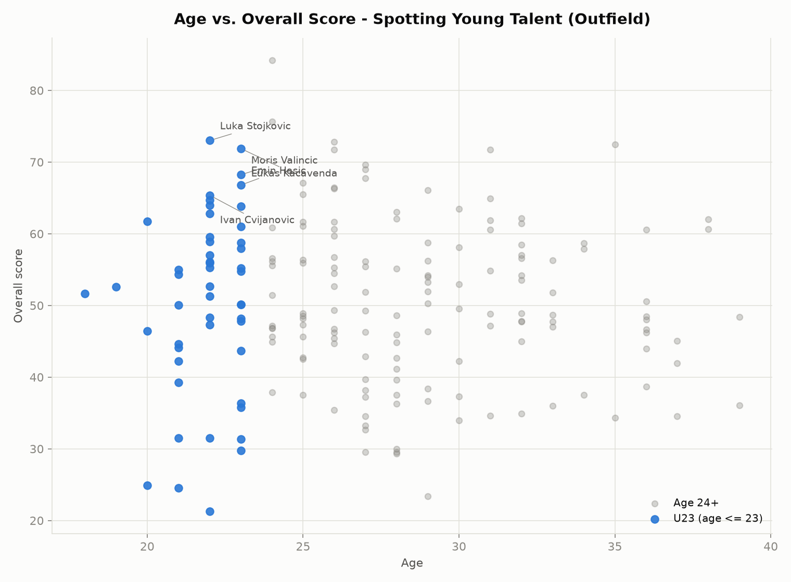

Every eligible **outfield** player's age against their `overall_score` (goalkeepers excluded, per Section 6), with U23 players highlighted and the top 5 labeled. Useful for spotting whether a young player's output is part of a broader pattern of emerging talent or a standalone outlier.

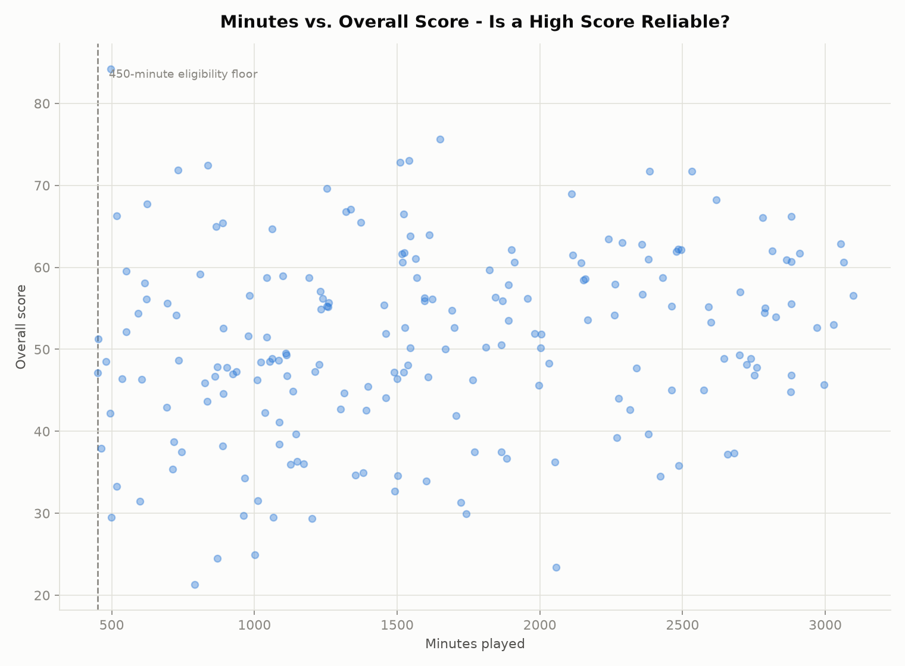

`overall_score` against minutes played, with the 450-minute eligibility floor marked. All points clear that floor by definition (lower-minute players are excluded from scoring entirely, per Section 4), but the spread still shows that scores near the floor are based on a much smaller sample than scores from players who played most of the season - worth weighing when comparing two similar scores.

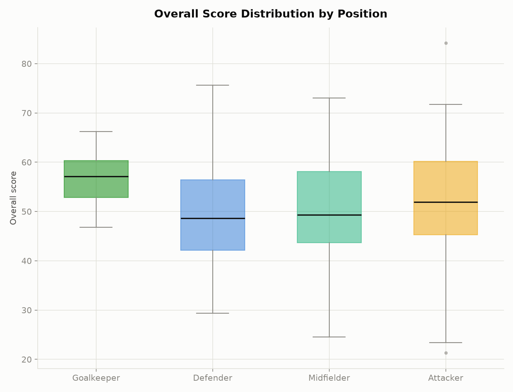

This is the chart that explains *why* position-aware scoring (Section 6) was worth adding, and why goalkeepers were removed from outfield rankings entirely: before Stage 1, `attacking_score` / `creative_score` / `defensive_score` were percentile ranks against the *whole* player pool, so a position with a naturally different stat profile would cluster at one extreme regardless of who the best player at that position actually was. Ranking within each position group fixed that for outfielders - but goalkeepers still show an oddly narrow, high-floor `overall_score` spread here even with position-aware scoring, because the underlying stats (goals, tackles, passing volume) barely apply to their job. That's the concrete evidence behind excluding them into their own `goalkeeper_score` model instead.

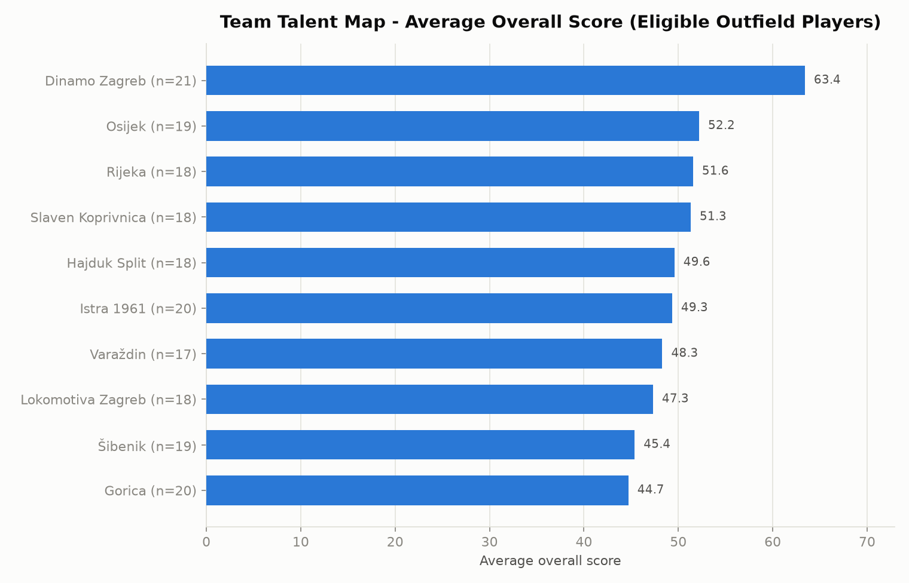

Average `overall_score` among eligible **outfield** players (450+ minutes, goalkeepers excluded) per club, with the eligible squad size shown in parentheses. This is a rough proxy for squad strength/depth, not a form table - it says nothing about results, only about individual statistical output. It's also the same data `team_average_score` (Section 17) is built from, per club.

## 23. Methodology Summary

A quick-reference recap of every formula introduced since the original pipeline - each is explained in full where it's first used above; this section just collects them in one place.

**Percentile scores (original pipeline)** - `attacking_score`, `creative_score`, `defensive_score`, `dribbling_score`, `passing_score`, `duel_defending_score`, `progressive_midfielder_score`, `passer_defender_score`, `goalkeeper_score`: each is an average of percentile ranks (0-100) on a handful of per-90/ratio stats, so raw scales never distort the blend. `overall_score = 0.3*attacking + 0.3*creative + 0.3*defensive + 0.1*discipline` (Section 6).

**`age_potential_score` (Section 8)** - `overall_score + age_bonus + reliability_bonus`. `age_bonus` = +2.0/year younger than 23, capped at +12 (6 years). `reliability_bonus` = percentile rank of minutes, capped at +8.

**`underrated_score` (Section 17)** - `overall_score + standout_bonus + weak_team_bonus`. `standout_bonus` = the positive part of `overall_score - team_average_score`, capped, at 0.5 weight. `weak_team_bonus` = the positive part of `league_average_team_score - team_average_score`, capped, at 0.5 weight. `hidden_gems` requires both bonuses > 0; `small_club_standouts` requires only `weak_team_bonus` > 0 and sorts by raw `overall_score`.

**Similarity search filters (Section 18)** - `same_position_only`, `same_team_exclude`, `min_minutes`, `max_age`: applied to candidates only, *after* cosine similarity is computed against the full pool, so filtering never changes what 'similar' means for the players who qualify.

**`replacement_score` (Section 20)** - `0.4*(similarity*100) + 0.3*age_potential_score + 0.2*underrated_score + 0.1*reliability_percentile + younger_bonus`. `reliability_percentile` is computed *within the candidate pool for that specific search*, not the whole league. `younger_bonus` is a flat +5, not a percentage weight.

**Player clustering (Section 21)** - KMeans on per-90/ratio features (outfield and goalkeepers clustered separately). Cluster names come from comparing each cluster's own feature averages against the population average (a z-score per feature), matched against predefined archetype signatures; unmatched clusters (below a 0.5 confidence bar) get a neutral `balanced profile` label, and position-implying names are demoted to a neutral alternative unless that position is an outright majority of the cluster.

## 24. Limitations

- **Goalkeepers are excluded from general outfield rankings because they require a separate goalkeeper-specific model.** `goalkeeper_score` (Section 7) covers saves, clean sheets, goals conceded, and penalties saved, but it's a simple percentile model over a small population (17-23 keepers) - not a substitute for a dedicated shot-stopping model (e.g. post-shot xG).
- **Coarse positions only.** SportMonks exposes just `Defender` / `Midfielder` / `Attacker` / `Goalkeeper` here, with no detailed sub-position (centre-back vs. full-back vs. wing-back). Anywhere this report says 'defender', it means all of those at once.
- **No true progressive passes/carries or expected assists (xA).** `progressive_midfielder_score` is a proxy built from key passes, long balls, dribbles, and assists - useful, but not the same metric a platform with tracking data would compute.
- **`overall_score` can still favor all-rounders over pure specialists**, even after making its three ingredients position-aware, because it averages across attacking/creative/defensive contribution. A player who is elite at exactly one thing and does nothing else will usually rank higher on a role-specific score (Sections 9-16) than on `overall_score`.
- **`age_potential_score`, `underrated_score`, and `replacement_score` are explainable proxies, not ground truth.** They combine already-approximate scores with simple, capped bonuses - useful for a reproducible first-pass shortlist, not a substitute for scouting judgment on potential, morale, injury history, or genuine market value.
- **`underrated_score`/`hidden_gems`/`small_club_standouts` are team-context proxies, not a market-value or true-team-strength model.** `team_average_score` only reflects this season's statistical output of a team's *eligible outfield* players - it says nothing about squad budget, wage bill, or league position.
- **Similarity search and replacement scouting do not replace video scouting.** They surface statistically comparable players as a first-pass shortlist; a human scout still has to watch the games. `replacement_score` in particular says nothing about transfer feasibility (fee, release clause, wages, contract length).
- **Player clusters describe playing style, not quality or literal position.** An elite and a modest player can share a cluster if their per-90 rates have a similar shape; a cluster's archetype name is demoted to a neutral one if the cluster's actual position makeup doesn't back up a position-specific claim (Section 21).
- **Role-specific rankings are better for scouting than one global ranking.** `best_overall`/`best_u23` are a reasonable 'who's good in general' view, but the specialist rankings (dribblers, passers, duel defenders, progressive midfielders, passer/ball-playing defenders, creators, ball winners, and their U23 versions) answer much more specific scouting questions and should usually be preferred over the single overall list.
- **This model ranks and compares statistical output - it does not evaluate talent, tactical fit, or injury/character risk.** It's a strong first-pass scouting/shortlisting tool, not a replacement for video scouting or human judgment.
- **A `�` character in a player's name (e.g. in a terminal) is a Windows console display quirk, not a data bug** - the underlying CSVs are correctly UTF-8 encoded (verified at the byte level); names like `Varaždin` and `Mejía` are stored correctly.

## 25. Next Improvements

- **Better position groups if SportMonks exposes detailed positions** for this competition/plan - would let `best_passer_defenders` distinguish centre-backs from full-backs, and would sharpen every position-aware score and cluster archetype.
- **Add real market value** as an extra lens alongside `underrated_score`, so 'underrated relative to teammates' can be checked against 'underrated relative to actual transfer value'.
- **Improve formulas with more seasons of history** - a single HNL season limits how much the scores and the optional rating/goals prediction models can be trusted; multiple seasons would support more robust percentile baselines, more stable cluster archetypes, and a meaningful supervised model.
- **Compare HNL players against other leagues** - all scores here are relative to the HNL player pool only, so a HNL-wide top score says nothing about how that player would rank in a stronger league; cross-league benchmarking would need a shared statistical baseline across competitions.
- **Refine cluster archetype signatures with feedback** - the z-score signature thresholds (Section 21) are a first pass; reviewing a season's worth of cluster assignments against known player profiles would help tune which features best separate each archetype.
- **A Streamlit dashboard** (planned, not yet built) - filters by team/age/position/minutes, a player profile view, specialist rankings, similarity search, replacement scouting, cluster profiles, charts, and an in-app report viewer.

