# HNL 2025/2026 Scouting Report

*Generated 2026-07-06 by `src/report.py`, from the current contents of `data/` and `reports/figures/`.*

## 1. Project Summary

This project turns raw SportMonks player statistics for the Croatian 1. HNL 2025/2026 season into a full scouting data pipeline: cleaned data, per-90 features, explainable scouting scores, position- and role-specific rankings, and a player-similarity search. Every number in this report is read directly from the CSVs the pipeline produces (`data/processed/`, `data/output/`) - nothing here is hand-picked.

## 2. Data Source

All player statistics come from the [SportMonks](https://www.sportmonks.com/) Football API, scoped to the Croatian HNL / 1. HNL, 2025/2026 season. `fetch_data.py` finds the league/season IDs, paginates through every team's squad statistics, and saves the raw JSON response before anything is cleaned or transformed - so the raw response is always available to re-process if the cleaning logic changes (as it did in Stage 1, below).

## 3. Dataset Summary

| Metric | Count |
|:---|:---|
| Raw player rows (minutes > 0, before de-duplication) | 345 |
| Rows after de-duplication | 332 |
| Duplicate player rows removed | 13 |
| Players eligible for scoring (>= 450 minutes) | 218 |

The raw SportMonks response actually contains far more than the original pipeline used: of 55 distinct statistic types present in the JSON, only 15 were mapped to columns before Stage 1. Dribbles, key passes, crosses, long balls, aerials won, clearances, and fouls drawn were sitting in the data unused - Stage 1 mapped 11 of them (see Section 5 and Sections 11-15).

## 4. Why Per-90 Stats?

Raw totals (goals, tackles, passes...) aren't comparable between players directly, because playing time varies enormously - a squad player with 5 goals in 900 minutes is doing far better than a regular starter with 5 goals in 2700 minutes. Dividing every counting stat by minutes played and scaling to a full match (`per90 = count / minutes * 90`) puts every player on the same footing regardless of how often their team picked them. All scouting scores in this project are built from per-90 rates and ratios, never raw totals (the two counting-stat exceptions - `top_scorers` and `top_assists` - are deliberately traditional Golden-Boot-style leaderboards, not scouting tools).

## 5. Deduplication Fix (Stage 1)

Some players' SportMonks records list squad membership at two clubs in the same season (typically a mid-season transfer or loan). That duplicated their row in the cleaned data - but `statistics.details` isn't split per club spell, so **both rows carried the exact same full-season totals**. Left alone, that would double-count those players in every per-90 rate and every ranking they appear in.

**The fix:** keep exactly one row per `player_id` - the row with the most minutes played. If the two rows disagreed on team name, that's logged as a warning during the pipeline run so it's visible, not silently dropped. This took the dataset from **345 rows to 332 rows** (13 duplicate rows removed).

## 6. Top 10 Overall Players

**Goalkeepers are excluded from general outfield rankings because they require a separate goalkeeper-specific model.** `overall_score` is built entirely from outfield actions - goals, assists, tackles, passes - that goalkeepers essentially never record, so it isn't a meaningful measure of goalkeeping quality (see "Best Goalkeepers" right after Section 7 for the dedicated `goalkeeper_score` ranking, built on stats that actually apply to keepers).

| Rank | Player | Team | Position | Age | Overall |
|:---|:---|:---|:---|:---|:---|
| 1 | Gabriel Vidovic | Dinamo Zagreb | Attacker | 22 | 85.2 |
| 2 | Marko Soldo | Dinamo Zagreb | Midfielder | 22 | 82.2 |
| 3 | Sergi Domínguez | Dinamo Zagreb | Defender | 21 | 79.4 |
| 4 | Ljuban Crepulja | Slaven Koprivnica | Midfielder | 32 | 74.5 |
| 5 | Ismaël Bennacer | Dinamo Zagreb | Midfielder | 28 | 74.0 |
| 6 | Iker Pozo | Gorica | Midfielder | 25 | 72.2 |
| 7 | Adriano Jagusic | Slaven Koprivnica | Midfielder | 20 | 70.3 |
| 8 | Scott McKenna | Dinamo Zagreb | Defender | 29 | 70.2 |
| 9 | Mateo Lisica | Dinamo Zagreb | Attacker | 22 | 68.8 |
| 10 | Miha Zajc | Dinamo Zagreb | Midfielder | 32 | 68.5 |

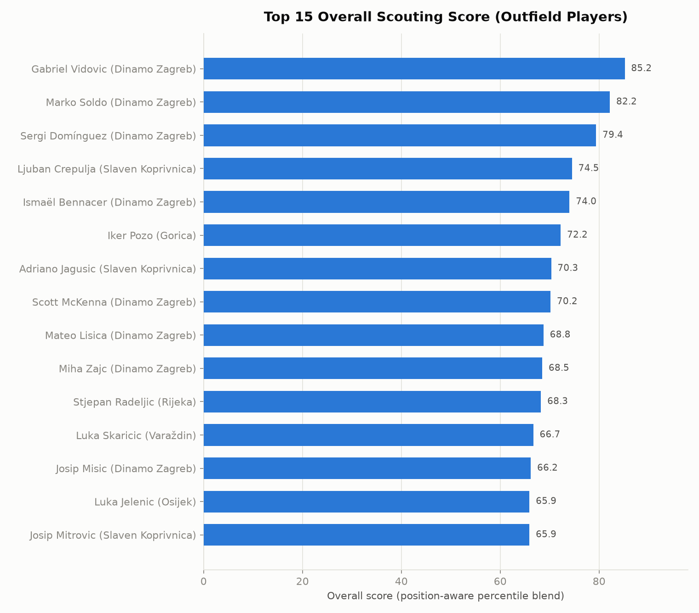

`overall_score` blends attacking, creative, and defensive contribution (each judged against same-position peers) plus a small discipline factor. Because each ingredient is now position-aware (Section 19 explains why), this list is no longer structurally tilted toward all-round midfielders - a specialist can top it by excelling relative to their own role's peers.

## 7. Best U23 Players

| Rank | Player | Team | Position | Age | Overall |
|:---|:---|:---|:---|:---|:---|
| 1 | Gabriel Vidovic | Dinamo Zagreb | Attacker | 22 | 85.2 |
| 2 | Marko Soldo | Dinamo Zagreb | Midfielder | 22 | 82.2 |
| 3 | Sergi Domínguez | Dinamo Zagreb | Defender | 21 | 79.4 |
| 4 | Adriano Jagusic | Slaven Koprivnica | Midfielder | 20 | 70.3 |
| 5 | Mateo Lisica | Dinamo Zagreb | Attacker | 22 | 68.8 |
| 6 | Niko Sigur | Hajduk Split | Midfielder | 22 | 64.6 |
| 7 | Luka Stojkovic | Dinamo Zagreb | Midfielder | 22 | 64.1 |
| 8 | Iker Almena | Hajduk Split | Attacker | 22 | 61.4 |
| 9 | Fran Topic | Dinamo Zagreb | Attacker | 22 | 60.9 |
| 10 | Samuel Akere | Osijek | Attacker | 22 | 60.6 |

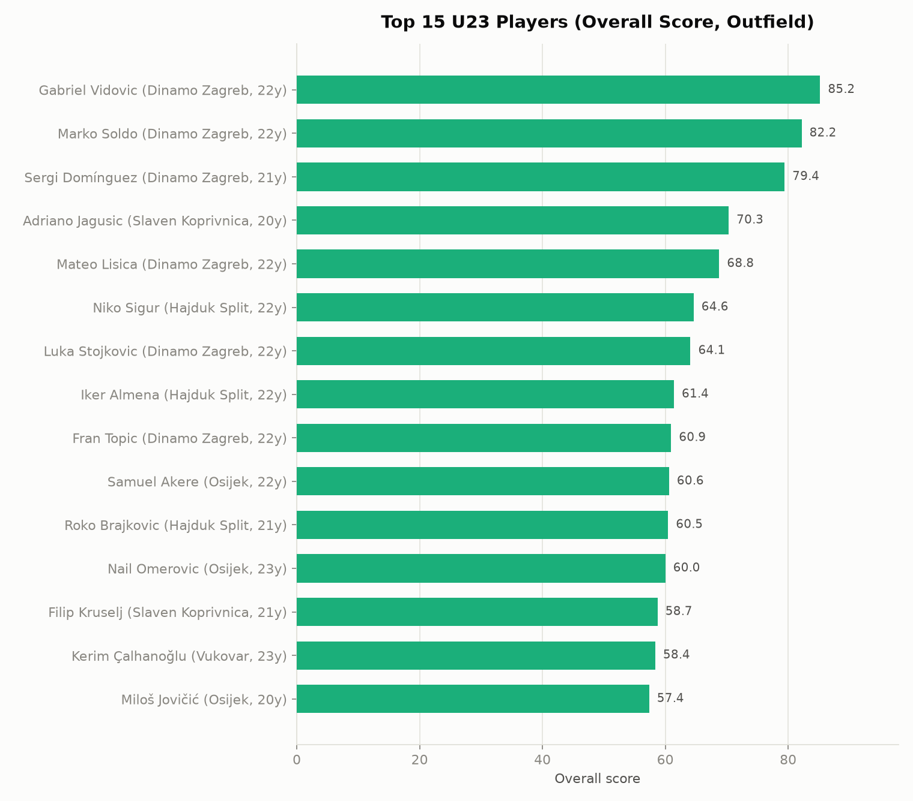

Same `overall_score` ranking, filtered to age 23 and under. Useful for spotting resale/development value rather than just current output.

### Best Goalkeepers (Separate Model)

Goalkeeping requires different inputs than outfield play, so `goalkeeper_score` is built from stats mapped specifically for this fix: saves per 90, clean sheet rate, goals conceded per 90 (inverted - fewer is better), penalties saved, and pass accuracy as a simple distribution-quality proxy. It's computed only among goalkeepers and never mixed with `overall_score`.

| Rank | Player | Team | Age | Goalkeeper Score |
|:---|:---|:---|:---|:---|
| 1 | Ivan Filipovic | Dinamo Zagreb | 31 | 65.9 |
| 2 | Dominik Livakovic | Dinamo Zagreb | 31 | 65.9 |
| 3 | Oliver Zelenika | Varaždin | 33 | 64.1 |
| 4 | Toni Silic | Hajduk Split | 22 | 61.2 |
| 5 | Martin Zlomislic | Rijeka | 27 | 60.6 |
| 6 | Marko Malenica | Osijek | 32 | 60.0 |
| 7 | Ivica Ivusic | Hajduk Split | 31 | 60.0 |
| 8 | Ivan Nevistic | Dinamo Zagreb | 27 | 58.8 |
| 9 | Mateusz Stolarski | Slaven Koprivnica | 35 | 54.7 |
| 10 | Josip Posavec | Lokomotiva Zagreb | 30 | 54.7 |

**Caveat:** this is a simple, explainable model over a small population (17-23 eligible goalkeepers) - it is not equivalent to a specialized goalkeeping model (e.g. post-shot expected goals / shot-stopping value above expected), which would need shot placement and quality data this API doesn't expose here.

## 8. Best Attackers

| Rank | Player | Team | Position | Age | Attacking |
|:---|:---|:---|:---|:---|:---|
| 1 | Dion Beljo | Dinamo Zagreb | Attacker | 24 | 99.4 |
| 2 | Sandro Kulenovic | Dinamo Zagreb | Attacker | 26 | 98.8 |
| 3 | Michele Sego | Hajduk Split | Attacker | 25 | 93.2 |
| 4 | Monsef Bakrar | Dinamo Zagreb | Attacker | 25 | 90.1 |
| 5 | Smail Prevljak | Istra 1961 | Attacker | 31 | 87.0 |
| 6 | Jakov Puljic | Vukovar | Attacker | 32 | 86.4 |
| 7 | Ivan Mamut | Varaždin | Attacker | 29 | 86.4 |
| 8 | Ante Erceg | Gorica | Attacker | 36 | 85.2 |
| 9 | Marko Livaja | Hajduk Split | Attacker | 32 | 82.7 |
| 10 | Gabriel Vidovic | Dinamo Zagreb | Attacker | 22 | 79.6 |

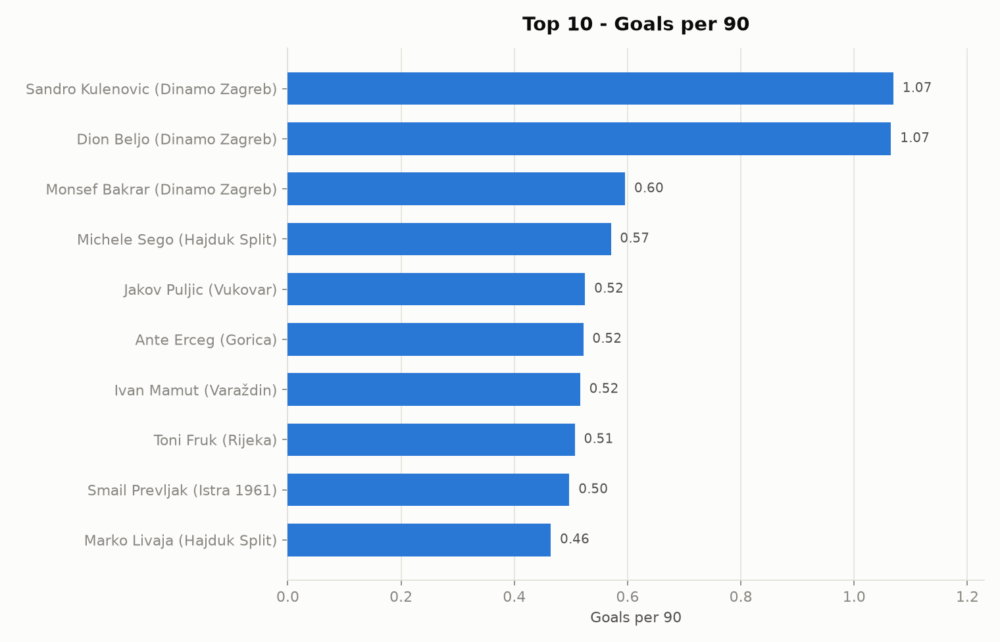

`attacking_score` is goal output, shots on target, and finishing quality, judged against other attackers - not raw goal totals, so a striker who has played fewer minutes but finishes efficiently isn't buried under a regular starter with more minutes.

## 9. Best Creators

| Rank | Player | Team | Position | Age | Creative |
|:---|:---|:---|:---|:---|:---|
| 1 | Mateo Lisica | Dinamo Zagreb | Attacker | 22 | 98.8 |
| 2 | Gabriel Vidovic | Dinamo Zagreb | Attacker | 22 | 96.3 |
| 3 | Ljuban Crepulja | Slaven Koprivnica | Midfielder | 32 | 95.4 |
| 4 | Ismaël Bennacer | Dinamo Zagreb | Midfielder | 28 | 91.3 |
| 5 | Domagoj Antolic | Lokomotiva Zagreb | Midfielder | 36 | 90.8 |
| 6 | Scott McKenna | Dinamo Zagreb | Defender | 29 | 88.6 |
| 7 | Ivan Canjuga | Varaždin | Attacker | 20 | 88.3 |
| 8 | Sergi Domínguez | Dinamo Zagreb | Defender | 21 | 87.4 |
| 9 | Matteo Pérez Vinlöf | Dinamo Zagreb | Defender | 20 | 82.9 |
| 10 | Branimir Mlacic | Hajduk Split | Defender | 19 | 82.7 |

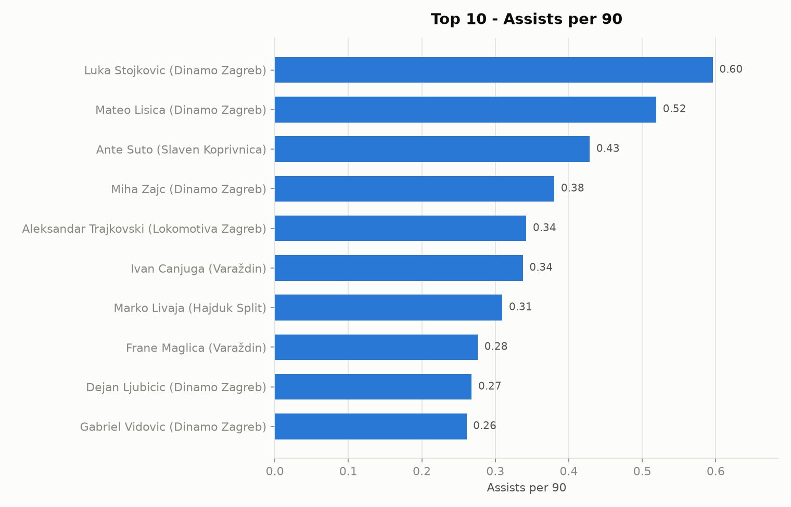

Unlike `best_midfield_creators` (position-filtered), `best_creators` is open to every position - it's a league-wide leaderboard of `creative_score` (assists, passing volume, passing quality), so a creative attacker or full-back can appear here too.

## 10. Best Defenders

| Rank | Player | Team | Position | Age | Defensive |
|:---|:---|:---|:---|:---|:---|
| 1 | Mohamed Nasraoui | Istra 1961 | Defender | 23 | 96.3 |
| 2 | Bruno Goda | Dinamo Zagreb | Defender | 28 | 82.9 |
| 3 | Marcel Heister | Istra 1961 | Defender | 33 | 81.7 |
| 4 | Elvir Durakovic | Gorica | Defender | 26 | 79.7 |
| 5 | Denis Kolinger | Lokomotiva Zagreb | Defender | 32 | 77.2 |
| 6 | Sergi Domínguez | Dinamo Zagreb | Defender | 21 | 76.0 |
| 7 | Tino Jukic | Lokomotiva Zagreb | Defender | 24 | 73.2 |
| 8 | Advan Kadusic | Istra 1961 | Defender | 28 | 72.8 |
| 9 | Gregor Sikosek | Varaždin | Defender | 32 | 72.0 |
| 10 | Antonio Jakir | Slaven Koprivnica | Defender | 23 | 71.5 |

`defensive_score` (tackles, interceptions, duel success) is judged against other defenders, so it measures 'best defender relative to defenders', not 'most tackles in the league' - see `best_duel_defenders` (Section 13) for the raw, pool-wide version of ball-winning ability.

## 11. Best Dribblers

| Rank | Player | Team | Position | Dribbles/90 | Success % |
|:---|:---|:---|:---|:---|:---|
| 1 | Ismaël Bennacer | Dinamo Zagreb | Midfielder | 2.17 | 62.2 |
| 2 | Robin González | Vukovar | Midfielder | 2.02 | 58.9 |
| 3 | Matej Vuk | Varaždin | Attacker | 2.12 | 59.7 |
| 4 | Iker Pozo | Gorica | Midfielder | 1.69 | 64.6 |
| 5 | Iker Almena | Hajduk Split | Attacker | 2.01 | 56.5 |
| 6 | Toni Fruk | Rijeka | Midfielder | 1.65 | 52.0 |
| 7 | Rokas Pukstas | Hajduk Split | Midfielder | 1.39 | 54.3 |
| 8 | Matteo Pérez Vinlöf | Dinamo Zagreb | Defender | 1.58 | 64.4 |
| 9 | David Mejía | Vukovar | Midfielder | 1.33 | 78.6 |
| 10 | Leon Bošnjak | Slaven Koprivnica | Midfielder | 1.48 | 57.1 |

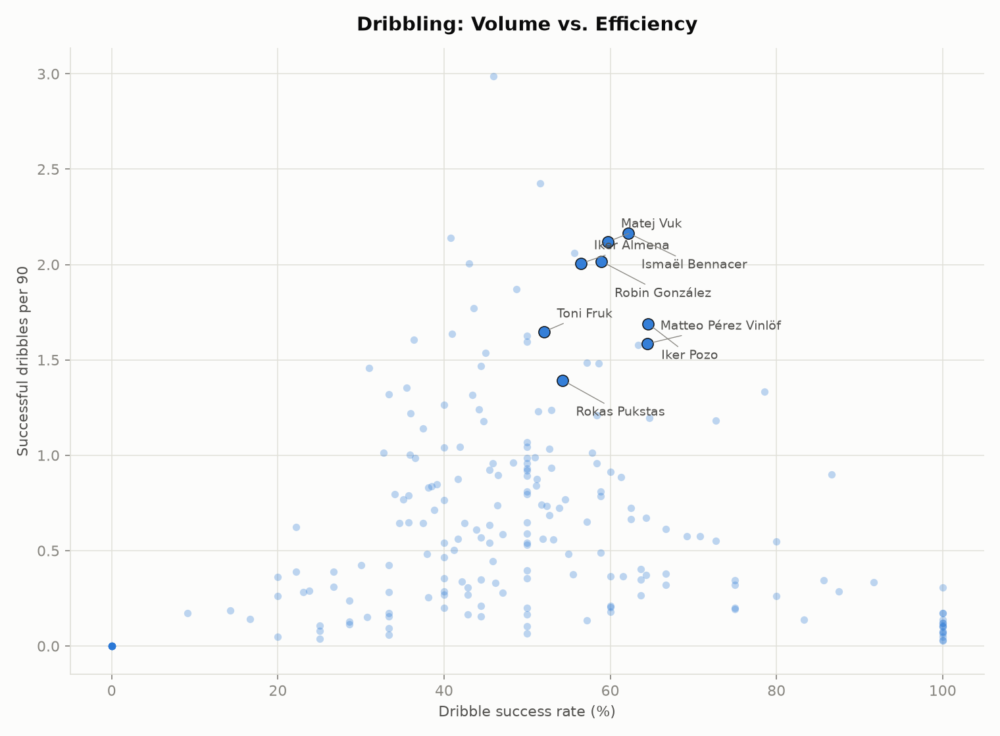

`dribbling_score` combines volume (successful dribbles per 90) with quality (% of attempts that succeed), so a player who tries 10 to land 2 doesn't outrank one who tries 3 to land 2. The scatter above makes that trade-off visible: top-right is the rare combination of trying often *and* succeeding often.

## 12. Best Passers

| Rank | Player | Team | Position | Passes/90 | Key Passes/90 | Accuracy % |
|:---|:---|:---|:---|:---|:---|:---|
| 1 | Ljuban Crepulja | Slaven Koprivnica | Midfielder | 65.3 | 1.76 | 89.6 |
| 2 | Ismaël Bennacer | Dinamo Zagreb | Midfielder | 63.1 | 1.69 | 89.2 |
| 3 | Tiago Dantas | Rijeka | Midfielder | 43.8 | 2.75 | 87.3 |
| 4 | Domagoj Antolic | Lokomotiva Zagreb | Midfielder | 58.0 | 1.33 | 90.6 |
| 5 | Hugo Guillamón | Hajduk Split | Midfielder | 69.7 | 1.18 | 87.3 |
| 6 | Josip Misic | Dinamo Zagreb | Midfielder | 53.0 | 1.32 | 88.2 |
| 7 | Marijan Cabraja | Gorica | Defender | 50.9 | 1.35 | 80.5 |
| 8 | Luka Stojkovic | Dinamo Zagreb | Midfielder | 45.7 | 3.03 | 84.6 |
| 9 | Matteo Pérez Vinlöf | Dinamo Zagreb | Defender | 54.2 | 1.15 | 84.8 |
| 10 | Noel Bodetic | Rijeka | Defender | 44.1 | 1.71 | 86.2 |

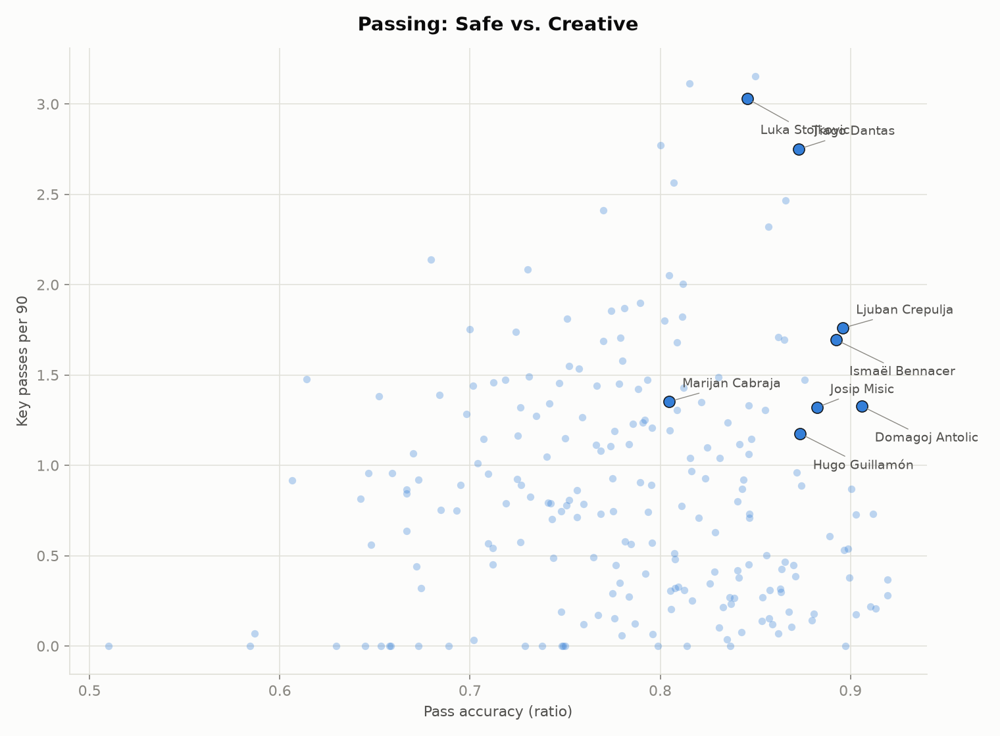

`passing_score` deliberately treats pass accuracy as only one of five equally-weighted ingredients - a centre-back playing safe five-yard passes all game can hit 95% accuracy without creating anything. The scatter separates 'safe' passers (bottom-right: high accuracy, few key passes) from genuinely creative ones (top area: passes that actually lead to a shot).

## 13. Best Duel Defenders

| Rank | Player | Team | Position | Tackles/90 | Interceptions/90 | Aerials Won/90 |
|:---|:---|:---|:---|:---|:---|:---|
| 1 | Mohamed Nasraoui | Istra 1961 | Defender | 2.69 | 2.48 | 2.82 |
| 2 | Mario Marina | Varaždin | Midfielder | 3.44 | 1.37 | 2.18 |
| 3 | Vinko Medjimorec | Slaven Koprivnica | Defender | 1.13 | 2.36 | 3.18 |
| 4 | Denis Kolinger | Lokomotiva Zagreb | Defender | 1.87 | 1.47 | 3.34 |
| 5 | Sergi Domínguez | Dinamo Zagreb | Defender | 1.96 | 1.33 | 3.04 |
| 6 | Tino Jukic | Lokomotiva Zagreb | Defender | 1.81 | 1.42 | 2.00 |
| 7 | Bruno Goda | Dinamo Zagreb | Defender | 2.72 | 1.36 | 2.04 |
| 8 | Jakov Suver | Vukovar | Defender | 1.38 | 1.38 | 1.73 |
| 9 | David Puclin | Varaždin | Midfielder | 3.80 | 1.07 | 2.02 |
| 10 | Jon Mersinaj | Osijek | Defender | 1.60 | 1.20 | 2.40 |

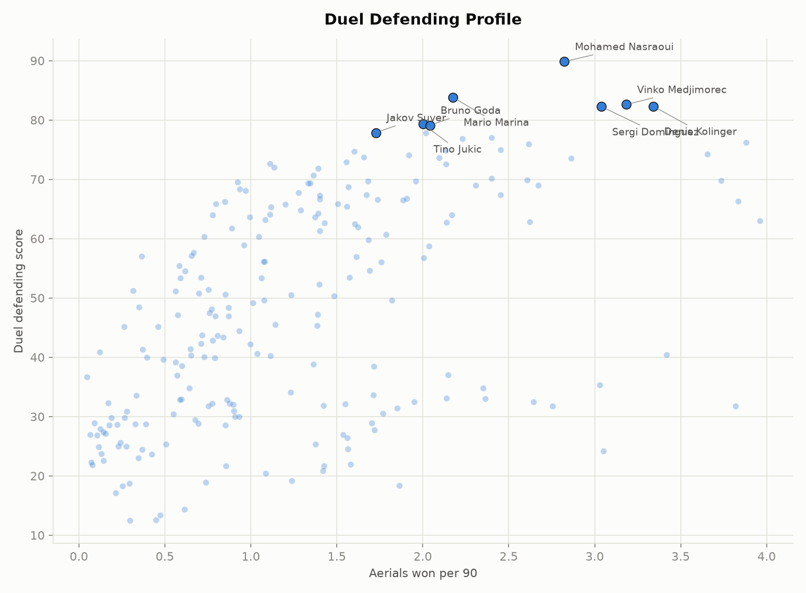

`duel_defending_score` is pure ball-winning ability (tackles, interceptions, aerials, duel success), judged league-wide rather than only against other defenders - so a defensively strong midfielder can also show up here, which `best_defenders` (position-filtered) would miss.

## 14. Best Progressive Midfielders

| Rank | Player | Team | Age | Progressive MF | Key Passes/90 |
|:---|:---|:---|:---|:---|:---|
| 1 | Ismaël Bennacer | Dinamo Zagreb | 28 | 84.2 | 1.69 |
| 2 | Adriano Jagusic | Slaven Koprivnica | 20 | 79.6 | 1.82 |
| 3 | Miha Zajc | Dinamo Zagreb | 32 | 77.7 | 3.15 |
| 4 | Ljuban Crepulja | Slaven Koprivnica | 32 | 76.9 | 1.76 |
| 5 | Luka Stojkovic | Dinamo Zagreb | 22 | 74.6 | 3.03 |
| 6 | David Mejía | Vukovar | 23 | 74.2 | 1.33 |
| 7 | Toni Fruk | Rijeka | 25 | 74.2 | 1.90 |
| 8 | Domagoj Antolic | Lokomotiva Zagreb | 36 | 71.2 | 1.33 |
| 9 | Stjepan Loncar | Istra 1961 | 29 | 70.8 | 1.68 |
| 10 | Tiago Dantas | Rijeka | 25 | 69.6 | 2.75 |

**Important caveat:** SportMonks doesn't expose true 'progressive passes' or 'progressive carries into the final third' on this plan, so `progressive_midfielder_score` is a **proxy** built from what is available - key passes, long balls, successful dribbles, and assists. It's a reasonable stand-in, not the real metric elite scouting platforms use, and should be read as 'forward-thinking involvement', not literal progressive-pass counts.

## 15. Best Passer Defenders / Ball-Playing Defenders

| Rank | Player | Team | Age | Passer Defender | Passes/90 | Accuracy % |
|:---|:---|:---|:---|:---|:---|:---|
| 1 | Sergi Domínguez | Dinamo Zagreb | 21 | 79.0 | 73.3 | 87.1 |
| 2 | Tino Jukic | Lokomotiva Zagreb | 24 | 72.9 | 55.4 | 85.8 |
| 3 | Stjepan Radeljic | Rijeka | 28 | 71.4 | 59.1 | 85.6 |
| 4 | Mohamed Nasraoui | Istra 1961 | 23 | 71.3 | 40.8 | 80.8 |
| 5 | Ron Raci | Hajduk Split | 23 | 69.8 | 52.0 | 91.3 |
| 6 | Bruno Goda | Dinamo Zagreb | 28 | 69.5 | 49.6 | 79.0 |
| 7 | Ante Majstorovic | Rijeka | 32 | 68.8 | 60.7 | 85.4 |
| 8 | Niko Galesic | Dinamo Zagreb | 25 | 68.5 | 61.6 | 87.0 |
| 9 | Luka Skaricic | Varaždin | 24 | 66.9 | 47.3 | 83.7 |
| 10 | Dominik Kovacic | Slaven Koprivnica | 32 | 66.8 | 48.1 | 86.4 |

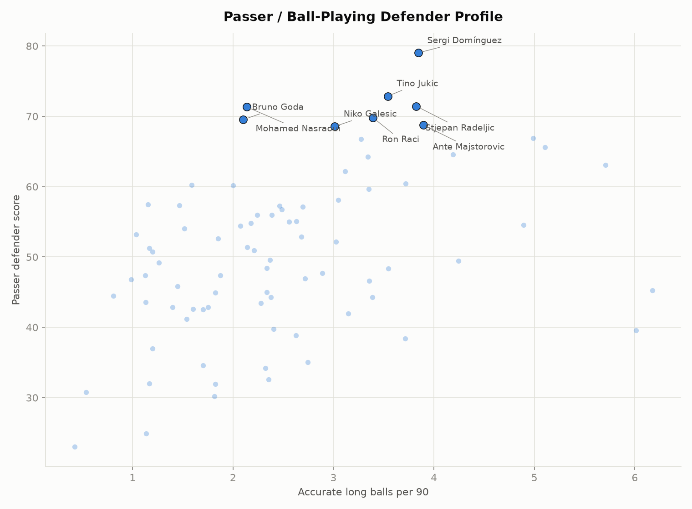

`best_passer_defenders` and `best_ball_playing_defenders` are **the same ranking** - both are sorted by one shared `passer_defender_score` (50% within-position passing quality, 50% `defensive_score`) rather than two separate formulas, by design decision during Stage 1/2.

**Position caveat:** SportMonks only exposes coarse positions here - `Defender`, `Midfielder`, `Attacker`, `Goalkeeper` - with no centre-back/full-back/wing-back split. So this ranking can say 'this defender passes and defends well' but cannot separate a ball-playing centre-back from an overlapping full-back the way a platform with detailed positions could.

### Comparing the specialists

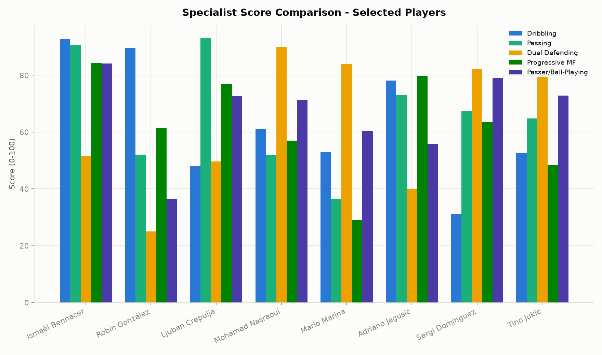

A snapshot of the five new specialist scores (Sections 11-15) side by side for a handful of players pulled from the top of each category. Notice how uneven each player's bars are - that's the point of having five separate scores instead of one: a player can be a 90+ dribbler and a below-average passer at the same time, and a single blended score would hide that.

## 16. Underrated Players

| Player | Team | Position | Age | Overall |
|:---|:---|:---|:---|:---|
| Ljuban Crepulja | Slaven Koprivnica | Midfielder | 32 | 74.5 |
| Iker Pozo | Gorica | Midfielder | 25 | 72.2 |
| Adriano Jagusic | Slaven Koprivnica | Midfielder | 20 | 70.3 |
| Luka Skaricic | Varaždin | Defender | 24 | 66.7 |
| Luka Jelenic | Osijek | Defender | 26 | 65.9 |
| Josip Mitrovic | Slaven Koprivnica | Attacker | 26 | 65.9 |
| Jakov Filipovic | Gorica | Defender | 33 | 64.2 |
| Marcel Heister | Istra 1961 | Defender | 33 | 62.1 |

'Underrated' here means a simple, reproducible proxy: highest `overall_score` among eligible players **outside** Dinamo Zagreb, Hajduk Split, Rijeka - the three clubs that get the most scouting attention in Croatian football. It's not a claim that these players are better than everyone at the big clubs, just that they're producing well relative to how much visibility their club typically gets.

## 17. Player Similarity Examples

**Ismaël Bennacer - role: `overall`**

| Rank | Player | Team | Position | Similarity |
|:---|:---|:---|:---|:---|
| 1 | Matteo Pérez Vinlöf | Dinamo Zagreb | Defender | 0.79 |
| 2 | Adriano Jagusic | Slaven Koprivnica | Midfielder | 0.65 |
| 3 | Ante Orec | Rijeka | Defender | 0.59 |
| 4 | Marko Pajac | Lokomotiva Zagreb | Defender | 0.59 |
| 5 | Ljuban Crepulja | Slaven Koprivnica | Midfielder | 0.59 |
| 6 | Domagoj Antolic | Lokomotiva Zagreb | Midfielder | 0.58 |
| 7 | Abdoulie Sanyang | Hajduk Split | Attacker | 0.55 |
| 8 | Adrion Pajaziti | Hajduk Split | Midfielder | 0.53 |
| 9 | Robin González | Vukovar | Midfielder | 0.53 |
| 10 | Hugo Guillamón | Hajduk Split | Midfielder | 0.51 |

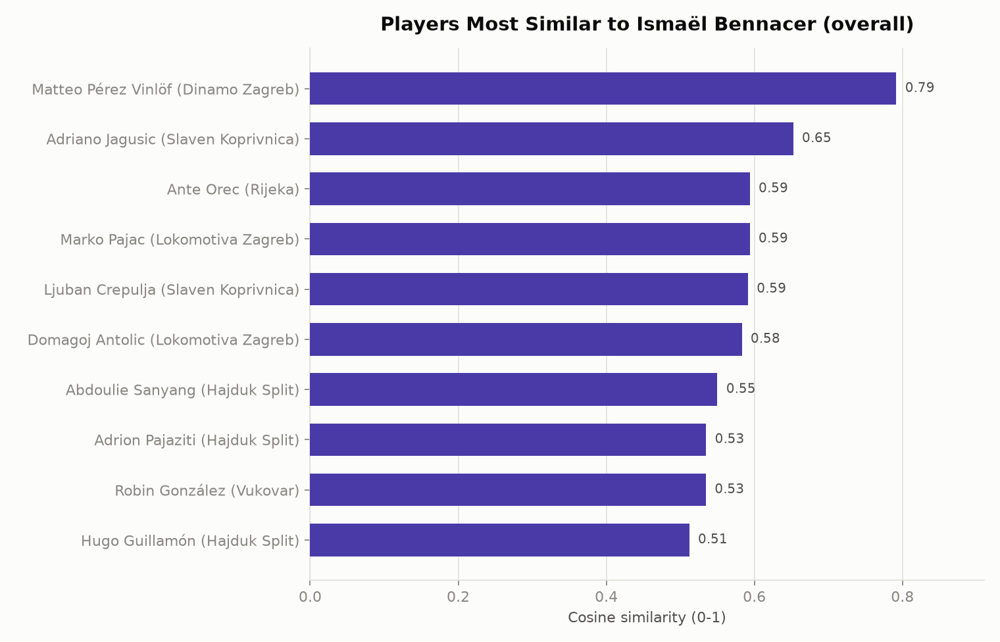

*The chart shows cosine similarity (0-1) for each match - see section 18 for what that number means.*

**Sergi Domínguez - role: `passer_defender`**

| Rank | Player | Team | Position | Similarity |
|:---|:---|:---|:---|:---|
| 1 | Niko Galesic | Dinamo Zagreb | Defender | 0.97 |
| 2 | Stjepan Radeljic | Rijeka | Defender | 0.96 |
| 3 | Tino Jukic | Lokomotiva Zagreb | Defender | 0.95 |
| 4 | Ante Majstorovic | Rijeka | Defender | 0.92 |
| 5 | Hrvoje Babec | Osijek | Midfielder | 0.91 |
| 6 | Hugo Guillamón | Hajduk Split | Midfielder | 0.91 |
| 7 | Dominik Kovacic | Slaven Koprivnica | Defender | 0.90 |
| 8 | Ville Koski | Istra 1961 | Defender | 0.89 |
| 9 | Dario Maresic | Istra 1961 | Defender | 0.88 |
| 10 | Ivan Cvijanovic | Osijek | Defender | 0.87 |

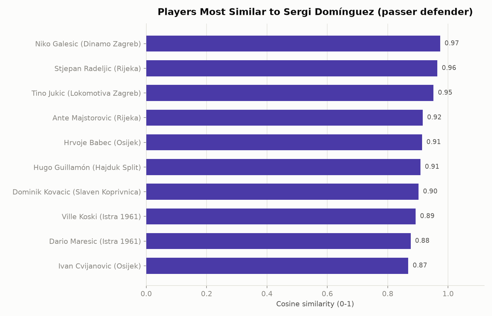

*The chart shows cosine similarity (0-1) for each match - see section 18 for what that number means.*

**Dion Beljo - role: `attacker`**

| Rank | Player | Team | Position | Similarity |
|:---|:---|:---|:---|:---|
| 1 | Sandro Kulenovic | Dinamo Zagreb | Attacker | 1.00 |
| 2 | Michele Sego | Hajduk Split | Attacker | 0.99 |
| 3 | Gabriel Vidovic | Dinamo Zagreb | Attacker | 0.99 |
| 4 | Smail Prevljak | Istra 1961 | Attacker | 0.98 |
| 5 | Monsef Bakrar | Dinamo Zagreb | Attacker | 0.98 |
| 6 | Jakov Puljic | Vukovar | Attacker | 0.98 |
| 7 | Marko Soldo | Dinamo Zagreb | Midfielder | 0.98 |
| 8 | Salim Fago Lawal | Istra 1961 | Attacker | 0.98 |
| 9 | Ivan Mamut | Varaždin | Attacker | 0.98 |
| 10 | Toni Fruk | Rijeka | Midfielder | 0.97 |

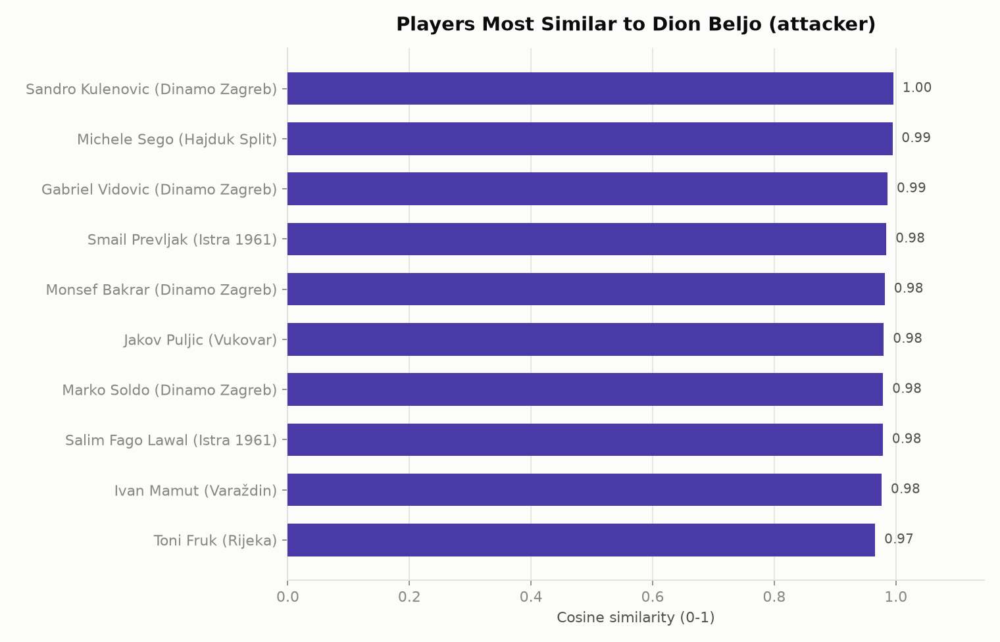

*The chart shows cosine similarity (0-1) for each match - see section 18 for what that number means.*

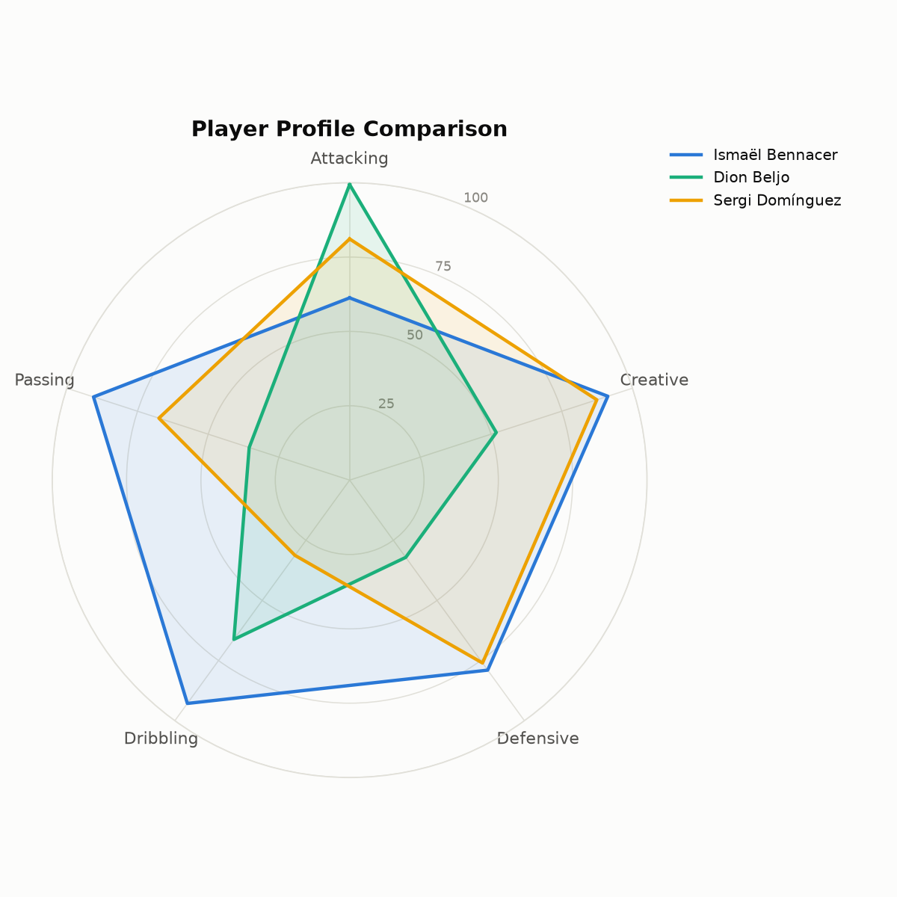

The radar chart puts all three query players on the same five axes (attacking/creative/defensive/dribbling/passing scores). It makes each player's *shape* obvious at a glance: Beljo spikes hard on attacking and barely registers elsewhere (a specialist profile), while Bennacer and Domínguez are more balanced across several dimensions - which is exactly why role-based similarity search (Section 18) matters more than a single 'overall' comparison.

## 18. How Cosine Similarity Works (in Scouting Terms)

Picture each player as a list of numbers - their per-90 rates and ratios for a chosen role (e.g. for `attacker`: `[goals_per90, shots_per90, shot_accuracy, ...]`). That list is a *vector*, a point in space with one axis per stat.

**Cosine similarity measures the angle between two players' vectors, not the distance.** That distinction matters: a bench player with 500 minutes and a nailed-on starter with 2500 minutes can have nearly identical *rates* (goals per 90, pass accuracy...) even though their raw totals are worlds apart. Cosine similarity says 'these two play the same way'; a raw-numbers comparison would wrongly say 'these two have nothing in common' just because one has played far more matches. A score of 1.0 means an identical statistical shape; 0 means no relationship. Every stat is standardized first (rescaled to the same spread) so a big-number stat like `passes_per90` doesn't automatically drown out a small-number stat like `goals_per90`.

**Why role-based, not one universal comparison:** comparing a striker to a centre-back on `shots_per90` is meaningless - the centre-back will always look like an outlier on stats that aren't part of their job. Each role (`attacker`, `passer`, `duel_defender`, ...) restricts the comparison to only the stats relevant to that role, so 'similar' means 'plays a similar game', not 'happens to share a few numbers by coincidence'.

## 19. Additional Charts

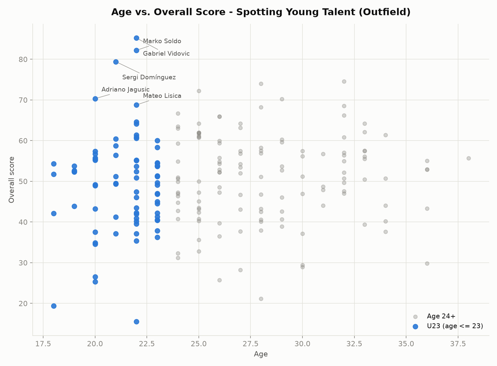

Every eligible **outfield** player's age against their `overall_score` (goalkeepers excluded, per Section 6), with U23 players highlighted and the top 5 labeled. Useful for spotting whether a young player's output is part of a broader pattern of emerging talent or a standalone outlier.

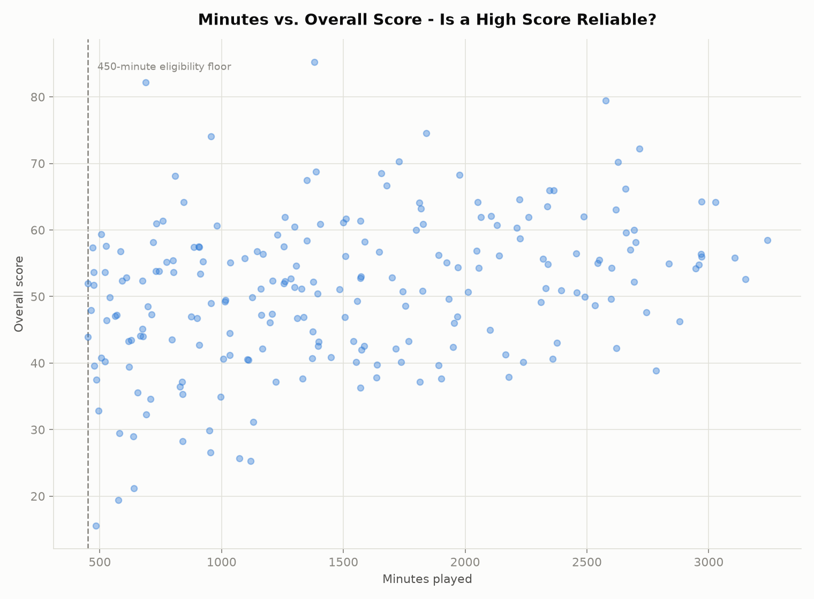

`overall_score` against minutes played, with the 450-minute eligibility floor marked. All points clear that floor by definition (lower-minute players are excluded from scoring entirely, per Section 4), but the spread still shows that scores near the floor are based on a much smaller sample than scores from players who played most of the season - worth weighing when comparing two similar scores.

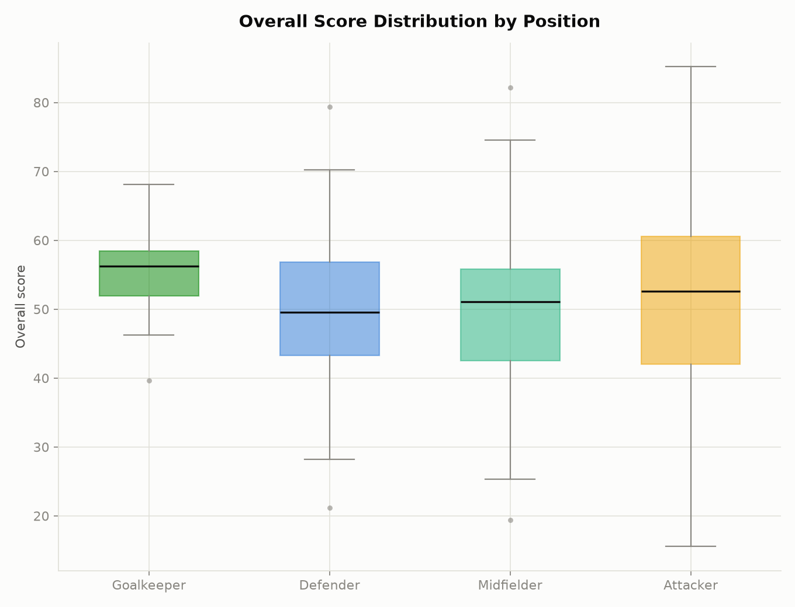

This is the chart that explains *why* position-aware scoring (Section 6) was worth adding, and why goalkeepers were removed from outfield rankings entirely: before Stage 1, `attacking_score` / `creative_score` / `defensive_score` were percentile ranks against the *whole* player pool, so a position with a naturally different stat profile would cluster at one extreme regardless of who the best player at that position actually was. Ranking within each position group fixed that for outfielders - but goalkeepers still show an oddly narrow, high-floor `overall_score` spread here even with position-aware scoring, because the underlying stats (goals, tackles, passing volume) barely apply to their job. That's the concrete evidence behind excluding them into their own `goalkeeper_score` model instead.

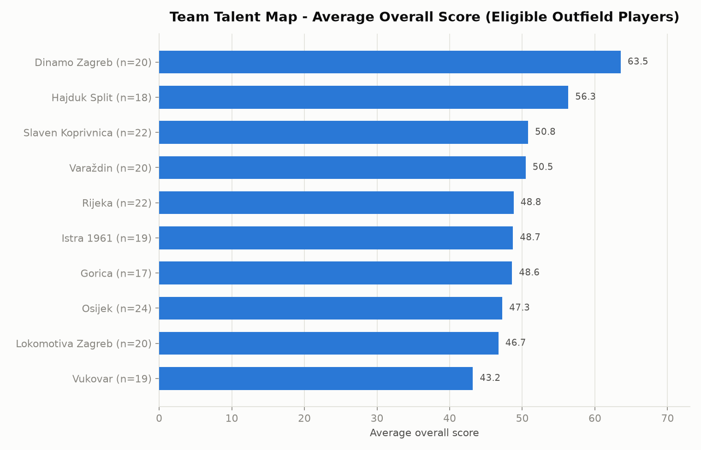

Average `overall_score` among eligible **outfield** players (450+ minutes, goalkeepers excluded) per club, with the eligible squad size shown in parentheses. This is a rough proxy for squad strength/depth, not a form table - it says nothing about results, only about individual statistical output.

## 20. Limitations

- **Goalkeepers are excluded from general outfield rankings because they require a separate goalkeeper-specific model.** `goalkeeper_score` (Section 7) covers saves, clean sheets, goals conceded, and penalties saved, but it's a simple percentile model over a small population (17-23 keepers) - not a substitute for a dedicated shot-stopping model (e.g. post-shot xG).
- **Coarse positions only.** SportMonks exposes just `Defender` / `Midfielder` / `Attacker` / `Goalkeeper` here, with no detailed sub-position (centre-back vs. full-back vs. wing-back). Anywhere this report says 'defender', it means all of those at once.
- **No true progressive passes/carries or expected assists (xA).** `progressive_midfielder_score` is a proxy built from key passes, long balls, dribbles, and assists - useful, but not the same metric a platform with tracking data would compute.
- **`overall_score` can still favor all-rounders over pure specialists**, even after making its three ingredients position-aware, because it averages across attacking/creative/defensive contribution. A player who is elite at exactly one thing and does nothing else will usually rank higher on a role-specific score (Sections 8-15) than on `overall_score`.
- **Role-specific rankings are better for scouting than one global ranking.** `best_overall`/`best_u23` are a reasonable 'who's good in general' view, but the specialist rankings (dribblers, passers, duel defenders, progressive midfielders, passer/ball-playing defenders, creators, ball winners, and their U23 versions) answer much more specific scouting questions and should usually be preferred over the single overall list.
- **This model ranks and compares statistical output - it does not evaluate talent, potential, tactical fit, or injury/character risk.** It's a strong first-pass scouting/shortlisting tool, not a replacement for video scouting or human judgment.
- **A `�` character in a player's name (e.g. in a terminal) is a Windows console display quirk, not a data bug** - the underlying CSVs are correctly UTF-8 encoded (verified at the byte level); names like `Varaždin` and `Mejía` are stored correctly.

## 21. Next Improvements

- **Same-position-only similarity option** - currently `overall` similarity can match a player to someone in a different position if their statistical shape lines up (see Bennacer's #1 match in Section 17); an optional same-position filter would give a stricter 'like-for-like' comparison when that's what's wanted.
- **Better position groups if SportMonks exposes detailed positions** for this competition/plan - would let `best_passer_defenders` distinguish centre-backs from full-backs, and would sharpen every position-aware score.
- **Add market value or age-based potential** as an extra lens alongside current output, so scouting rankings can separate 'productive now' from 'likely to keep improving'.
- **Improve formulas with more seasons of history** - a single HNL season limits how much the scores and the optional rating/goals prediction models can be trusted; multiple seasons would support more robust percentile baselines and a meaningful supervised model.
- **Compare HNL players against other leagues** - all scores here are relative to the HNL player pool only, so a HNL-wide top score says nothing about how that player would rank in a stronger league; cross-league benchmarking would need a shared statistical baseline across competitions.

